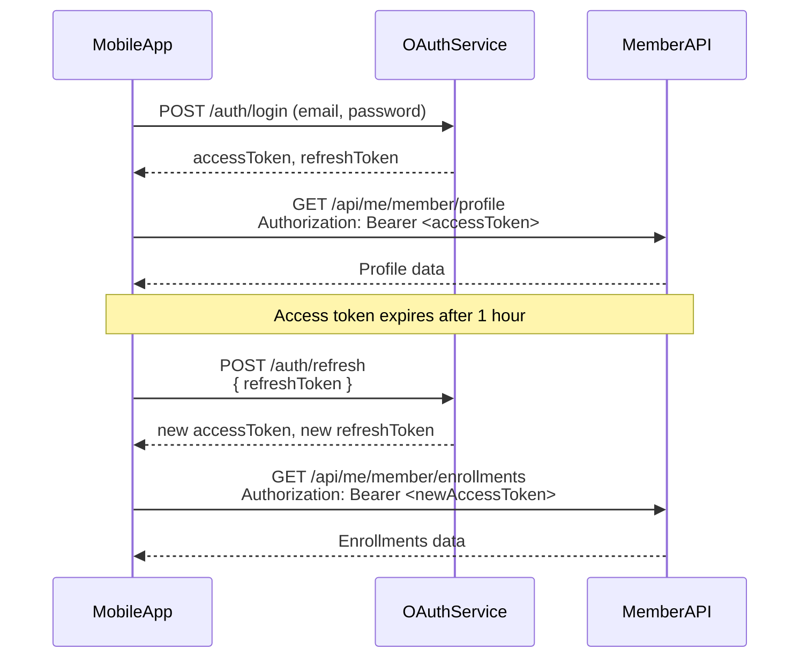

# Mobile App API Integration Documentation

Complete guide for mobile app developers to integrate with the Member Portal API. For session and "Keep me signed in" behavior, see [auth/MOBILE_APP_SESSION_AND_KEEP_ME_SIGNED_IN.md](auth/MOBILE_APP_SESSION_AND_KEEP_ME_SIGNED_IN.md).

## Table of Contents

1. [Introduction & Overview](#introduction--overview)
2. [Authentication & Authorization](#authentication--authorization)
3. [Member API Endpoints](#member-api-endpoints)
4. [Request/Response Formats](#requestresponse-formats)
5. [Data Models](#data-models)
6. [Error Handling](#error-handling)
7. [Code Examples](#code-examples)
8. [Security Considerations](#security-considerations)
9. [Rate Limiting & Best Practices](#rate-limiting--best-practices)

---

## Introduction & Overview

### API Base URLs

Auth and API are on the **same backend**. Use one base URL for both.

- **API Base URL** (and auth): `https://api.allaboard365.com` (production). Local: `http://localhost:3001`.

### API Conventions

- All endpoints require authentication via Bearer token
- All requests should use `Content-Type: application/json`
- All responses are in JSON format
- Dates are in ISO 8601 format (YYYY-MM-DD or YYYY-MM-DDTHH:mm:ssZ)
- IDs are UUIDs (GUIDs)
- Amounts are decimal numbers (e.g., `123.45`)

### Authentication Flow Overview

The API uses token-based authentication (same backend for auth and API):

1. User logs in with email and password via `POST {BASE_URL}/auth/login`
2. Backend returns `accessToken` and `refreshToken`
3. All API requests include `Authorization: Bearer <accessToken>` header
4. Access tokens are short-lived (e.g. 1 hour); refresh when you get 401
5. Refresh tokens are rotated on use; session length is capped by the server (see [auth/MOBILE_APP_SESSION_AND_KEEP_ME_SIGNED_IN.md](auth/MOBILE_APP_SESSION_AND_KEEP_ME_SIGNED_IN.md))



---

## Authentication & Authorization

### OAuth 2.0 Flow

#### 1. Login

**Endpoint**: `POST {BASE_URL}/auth/login` (e.g. `https://api.allaboard365.com/auth/login`)

**Request Headers**:
```
Content-Type: application/json
```

**Request Body**:
```json
{
  "email": "user@example.com",
  "password": "SecurePassword123!"
}
```

**Response** (200 OK):
```json
{
  "accessToken": "eyJhbGciOiJIUzI1NiIsInR5cCI6IkpXVCJ9...",
  "refreshToken": "a1b2c3d4e5f6g7h8i9j0k1l2m3n4o5p6..."
}
```

**Error Responses**:
- `401 Unauthorized`: Invalid credentials
  ```json
  {
    "message": "Invalid credentials"
  }
  ```

#### 2. Refresh Token

**Endpoint**: `POST {BASE_URL}/auth/refresh`

**Request Headers**:
```
Content-Type: application/json
```

**Request Body**:
```json
{
  "refreshToken": "a1b2c3d4e5f6g7h8i9j0k1l2m3n4o5p6..."
}
```

**Response** (200 OK):
```json
{
  "accessToken": "eyJhbGciOiJIUzI1NiIsInR5cCI6IkpXVCJ9...",
  "refreshToken": "x1y2z3a4b5c6d7e8f9g0h1i2j3k4l5m6..."
}
```

**Important**: The old refresh token is invalidated when a new one is issued. Always discard the old refresh token and store the new one.

**Error Responses**:
- `401 Unauthorized`: Invalid or expired refresh token
  ```json
  {
    "message": "Invalid or expired refresh token"
  }
  ```

#### 3. Logout

**Endpoint**: `POST {BASE_URL}/auth/logout`

**Request Headers**:
```
Content-Type: application/json
```

**Request Body**:
```json
{
  "refreshToken": "a1b2c3d4e5f6g7h8i9j0k1l2m3n4o5p6..."
}
```

**Response** (200 OK):
```json
{
  "message": "Logout successful. Token revoked."
}
```

#### 4. Get Current User Info (OAuth)

**Endpoint**: `GET {BASE_URL}/auth/me`

**Request Headers**:
```
Authorization: Bearer <accessToken>
Content-Type: application/json
```

**Response** (200 OK):
```json
{
  "message": "Authenticated",
  "user": {
    "userId": "123e4567-e89b-12d3-a456-426614174000",
    "email": "user@example.com"
  }
}
```

### Get Current User Profile with Roles

#### GET /api/users/me

Get the current authenticated user's profile information including roles from the `oe.UserRoles` table.

**Endpoint**: `GET {BASE_URL}/api/users/me`

**Request Headers**:
```
Authorization: Bearer <accessToken>
Content-Type: application/json
```

**Response** (200 OK):
```json
{
  "success": true,
  "data": {
    "UserId": "123e4567-e89b-12d3-a456-426614174000",
    "Email": "user@example.com",
    "FirstName": "John",
    "LastName": "Doe",
    "Status": "Active",
    "TenantId": "789e0123-e89b-12d3-a456-426614174002",
    "PhoneNumber": "555-1234",
    "CreatedDate": "2024-01-15T10:30:00Z",
    "ModifiedDate": "2024-01-15T10:30:00Z",
    "LastLoginDate": "2024-01-20T10:30:00Z",
    "roles": ["Member"],
    "currentRole": "Member"
  }
}
```

**Field Descriptions**:
- `UserId` (string, UUID): Unique user identifier
- `Email` (string): User's email address
- `FirstName` (string): User's first name
- `LastName` (string): User's last name
- `Status` (string): User status ("Active", "Inactive", etc.)
- `TenantId` (string, UUID): Tenant identifier the user belongs to
- `PhoneNumber` (string, optional): User's phone number
- `CreatedDate` (string, ISO 8601): Account creation timestamp
- `ModifiedDate` (string, ISO 8601): Last modification timestamp
- `LastLoginDate` (string, ISO 8601): Last login timestamp (updated on each request)
- `roles` (array of strings): All roles assigned to the user from `oe.UserRoles` table (e.g., `["Member"]`, `["Member", "Agent"]`)
- `currentRole` (string): The most powerful role based on hierarchy (e.g., "Member", "Agent", "TenantAdmin", "SysAdmin")

**Role Hierarchy** (most powerful to least):
1. `SysAdmin` - System Administrator
2. `TenantAdmin` - Tenant Administrator
3. `VendorAdmin` - Vendor Administrator
4. `VendorAgent` - Vendor Agent
5. `Agent` - Agent
6. `GroupAdmin` - Group Administrator
7. `Member` - Member

**Common Use Cases**:
- Determine user's roles for feature access control
- Check if user has specific permissions
- Display user information in app
- Determine which API endpoints the user can access

**Error Responses**:
- `404 Not Found`: User not found
  ```json
  {
    "success": false,
    "message": "User not found"
  }
  ```
- `401 Unauthorized`: Invalid or expired token
- `500 Internal Server Error`: Server error

**Note**: This endpoint automatically updates the user's `LastLoginDate` on each successful request. The `roles` array is populated from the `oe.UserRoles` table by the authentication middleware during token validation.

### Token Management

| Token Type | Lifetime | Renewability | Storage Recommendation |
|------------|----------|--------------|------------------------|
| Access Token | 1 hour | No | In-memory only (never persist) |
| Refresh Token | 7 days | Yes (rotated) | Secure storage (Keychain on iOS, EncryptedSharedPreferences on Android) |

### Token Refresh Strategy for Mobile Apps

**Proactive Refresh Pattern**:
1. Store refresh token securely (Keychain/EncryptedSharedPreferences)
2. Store access token expiration time
3. Before each API request, check if access token will expire within 5 minutes
4. If yes, refresh the token first
5. Always handle token refresh failures gracefully (prompt user to re-login)

**Example Token Refresh Logic**:
```javascript
// Pseudocode for token refresh
async function ensureValidAccessToken() {
  const expirationTime = getAccessTokenExpiration();
  const now = Date.now();
  const fiveMinutes = 5 * 60 * 1000;
  
  if (expirationTime - now < fiveMinutes) {
    // Token expires soon, refresh it
    const refreshToken = await getRefreshToken();
    const response = await fetch('{BASE_URL}/auth/refresh', {
      method: 'POST',
      headers: { 'Content-Type': 'application/json' },
      body: JSON.stringify({ refreshToken })
    });
    
    if (!response.ok) {
      // Refresh failed, user must re-login
      await clearTokens();
      navigateToLogin();
      throw new Error('Session expired');
    }
    
    const data = await response.json();
    await saveTokens(data.accessToken, data.refreshToken);
    return data.accessToken;
  }
  
  return getAccessToken();
}
```

### Role-Based Access Control

All member API endpoints require the `Member` role. The OAuth service validates the user's role during token validation. If a user doesn't have the required role, API requests will return `403 Forbidden`.

---

## Member API Endpoints

All member API endpoints are prefixed with `/api/me/member/` and require authentication.

### Standard Request Headers

```
Authorization: Bearer <accessToken>
Content-Type: application/json
```

### Standard Response Structure

All endpoints follow this response structure:

**Success Response**:
```json
{
  "success": true,
  "data": { /* endpoint-specific data */ },
  "message": "Optional success message"
}
```

**Error Response**:
```json
{
  "success": false,
  "message": "Human-readable error message",
  "error": {
    "message": "Detailed error message",
    "code": "ERROR_CODE"
  }
}
```

---

### Profile Management

#### GET /api/me/member/profile

Get the current member's profile information.

**Endpoint**: `GET {BASE_URL}/api/me/member/profile`

**Request Headers**:
```
Authorization: Bearer <accessToken>
```

**Response** (200 OK):
```json
{
  "success": true,
  "data": {
    "id": "123e4567-e89b-12d3-a456-426614174000",
    "firstName": "John",
    "lastName": "Doe",
    "email": "john.doe@example.com",
    "phone": "555-1234",
    "address": "123 Main Street",
    "city": "Anytown",
    "state": "CA",
    "zipCode": "12345",
    "memberStatus": "Active",
    "dateOfBirth": "1990-01-15",
    "tobaccoUse": "No",
    "tier": "EE",
    "relationshipType": "P",
    "jobPosition": "manager",
    "age": 34,
    "enrollmentDate": "2024-01-15T10:30:00Z",
    "groupId": "456e7890-e89b-12d3-a456-426614174001",
    "tenantId": "789e0123-e89b-12d3-a456-426614174002",
    "billType": "LB",
    "groupName": "Acme Corporation",
    "allowPlanModifications": true,
    "nextBillingDate": "2024-02-01",
    "agent": {
      "id": "321e6543-e89b-12d3-a456-426614174003",
      "firstName": "Jane",
      "lastName": "Smith",
      "email": "jane.smith@example.com",
      "phone": "555-5678"
    }
  }
}
```

**Error Responses**:
- `404 Not Found`: Member profile not found
  ```json
  {
    "success": false,
    "message": "Member profile not found",
    "error": {
      "message": "No member record found for this user",
      "code": "MEMBER_NOT_FOUND"
    }
  }
  ```
- `401 Unauthorized`: Invalid or expired token
- `500 Internal Server Error`: Server error

#### PUT /api/me/member/profile

Update the current member's profile information.

**Endpoint**: `PUT {BASE_URL}/api/me/member/profile`

**Request Headers**:
```
Authorization: Bearer <accessToken>
Content-Type: application/json
```

**Request Body**:
```json
{
  "firstName": "John",
  "lastName": "Doe",
  "phone": "555-1234",
  "address": "123 Main Street",
  "city": "Anytown",
  "state": "CA",
  "zipCode": "12345"
}
```

**Field Descriptions**:
- `firstName` (required, string): Member's first name
- `lastName` (required, string): Member's last name
- `phone` (optional, string): Phone number
- `address` (optional, string): Street address
- `city` (optional, string): City
- `state` (optional, string): State code (2 letters)
- `zipCode` (optional, string): ZIP code

**Response** (200 OK):
```json
{
  "success": true,
  "data": {
    "id": "123e4567-e89b-12d3-a456-426614174000",
    "firstName": "John",
    "lastName": "Doe",
    "email": "john.doe@example.com",
    "phone": "555-1234",
    "address": "123 Main Street",
    "city": "Anytown",
    "state": "CA",
    "zipCode": "12345",
    "memberStatus": "Active",
    "dateOfBirth": "1990-01-15",
    "enrollmentDate": "2024-01-15T10:30:00Z",
    "groupId": "456e7890-e89b-12d3-a456-426614174001"
  },
  "message": "Profile updated successfully"
}
```

**Error Responses**:
- `400 Bad Request`: Validation error
  ```json
  {
    "success": false,
    "message": "First name and last name are required",
    "error": {
      "message": "First name and last name are required",
      "code": "VALIDATION_ERROR"
    }
  }
  ```
- `404 Not Found`: Member profile not found
- `401 Unauthorized`: Invalid or expired token
- `500 Internal Server Error`: Server error

---

### Household Management

#### GET /api/me/member/household

Get all members in the current member's household (including themselves).

**Endpoint**: `GET {BASE_URL}/api/me/member/household`

**Request Headers**:
```
Authorization: Bearer <accessToken>
```

**Response** (200 OK):
```json
{
  "success": true,
  "data": {
    "householdMembers": [
      {
        "MemberId": "123e4567-e89b-12d3-a456-426614174000",
        "UserId": "234e5678-e89b-12d3-a456-426614174001",
        "RelationshipType": "P",
        "MemberSequence": 1,
        "HouseholdMemberID": "OED15990596",
        "Status": "Active",
        "DateOfBirth": "1990-01-15",
        "Gender": "Male",
        "Address": "123 Main Street",
        "City": "Anytown",
        "State": "CA",
        "Zip": "12345",
        "TerminationDate": null,
        "FirstName": "John",
        "LastName": "Doe",
        "Email": "john.doe@example.com",
        "PhoneNumber": "555-1234",
        "UserStatus": "Active",
        "UserTerminationDate": null,
        "RelationshipDescription": "Primary",
        "IsCurrentUser": 1,
        "IsExpired": 0,
        "IsPendingTermination": 0,
        "EffectiveTerminationDate": null
      },
      {
        "MemberId": "345e6789-e89b-12d3-a456-426614174002",
        "UserId": "456e7890-e89b-12d3-a456-426614174003",
        "RelationshipType": "S",
        "MemberSequence": 2,
        "HouseholdMemberID": "OED15990597",
        "Status": "Active",
        "DateOfBirth": "1992-05-20",
        "Gender": "Female",
        "FirstName": "Jane",
        "LastName": "Doe",
        "Email": "jane.doe@example.com",
        "PhoneNumber": "555-5678",
        "RelationshipDescription": "Spouse",
        "IsCurrentUser": 0,
        "IsExpired": 0,
        "IsPendingTermination": 0
      }
    ],
    "currentMemberRelationship": "P",
    "canManageHousehold": true
  }
}
```

**Field Descriptions**:
- `RelationshipType`: "P" (Primary), "S" (Spouse), "C" (Child)
- `canManageHousehold`: `true` if current member is Primary (P) or Spouse (S)
- `IsCurrentUser`: `1` if this is the authenticated member, `0` otherwise
- `IsExpired`: `1` if member is terminated/expired, `0` otherwise
- `IsPendingTermination`: `1` if member has a future termination date, `0` otherwise

**Error Responses**:
- `404 Not Found`: Member profile not found
- `401 Unauthorized`: Invalid or expired token
- `500 Internal Server Error`: Server error

#### POST /api/me/member/household/members

Add a new dependent (spouse or child) to the current member's household.

**Note**: Only Primary (P) or Spouse (S) members can add dependents.

**Endpoint**: `POST {BASE_URL}/api/me/member/household/members`

**Request Headers**:
```
Authorization: Bearer <accessToken>
Content-Type: application/json
```

**Request Body**:
```json
{
  "firstName": "Jane",
  "lastName": "Doe",
  "email": "jane.doe@example.com",
  "phone": "555-5678",
  "dateOfBirth": "1992-05-20",
  "gender": "Female",
  "address": "123 Main Street",
  "city": "Anytown",
  "state": "CA",
  "zip": "12345",
  "relationshipType": "S"
}
```

**Field Descriptions**:
- `firstName` (required, string): Dependent's first name
- `lastName` (required, string): Dependent's last name
- `email` (required, string): Unique email address (must not exist in system)
- `phone` (optional, string): Phone number
- `dateOfBirth` (optional, string): Date of birth (YYYY-MM-DD)
- `gender` (optional, string): Gender
- `address` (optional, string): Street address
- `city` (optional, string): City
- `state` (optional, string): State code
- `zip` (optional, string): ZIP code
- `relationshipType` (required, string): "S" (Spouse) or "C" (Child)

**Response** (201 Created):
```json
{
  "success": true,
  "data": {
    "MemberId": "345e6789-e89b-12d3-a456-426614174002",
    "UserId": "456e7890-e89b-12d3-a456-426614174003",
    "RelationshipType": "S",
    "MemberSequence": 2,
    "HouseholdMemberID": "OED15990597",
    "Status": "Active",
    "DateOfBirth": "1992-05-20",
    "Gender": "Female",
    "FirstName": "Jane",
    "LastName": "Doe",
    "Email": "jane.doe@example.com",
    "PhoneNumber": "555-5678",
    "RelationshipDescription": "Spouse"
  },
  "message": "Spouse added successfully"
}
```

**Error Responses**:
- `400 Bad Request`: Validation error or business rule violation
  ```json
  {
    "success": false,
    "message": "First name, last name, email, and relationship type are required",
    "error": {
      "message": "Missing required fields",
      "code": "VALIDATION_ERROR"
    }
  }
  ```
  ```json
  {
    "success": false,
    "message": "A spouse already exists in this household",
    "error": {
      "message": "Spouse already exists",
      "code": "SPOUSE_EXISTS"
    }
  }
  ```
  ```json
  {
    "success": false,
    "message": "A user with this email address already exists",
    "error": {
      "message": "Email already exists",
      "code": "EMAIL_EXISTS"
    }
  }
  ```
- `403 Forbidden`: Insufficient permissions (not Primary or Spouse)
  ```json
  {
    "success": false,
    "message": "Only primary members and spouses can add dependents",
    "error": {
      "message": "Insufficient permissions",
      "code": "PERMISSION_DENIED"
    }
  }
  ```
- `401 Unauthorized`: Invalid or expired token
- `500 Internal Server Error`: Server error

#### PUT /api/me/member/household/members/:memberId

Update a dependent's information in the current member's household.

**Note**: Only Primary (P) or Spouse (S) members can update dependents. Cannot update Primary member through this endpoint.

**Endpoint**: `PUT {BASE_URL}/api/me/member/household/members/{memberId}`

**Path Parameters**:
- `memberId` (required, UUID): The member ID of the dependent to update

**Request Headers**:
```
Authorization: Bearer <accessToken>
Content-Type: application/json
```

**Request Body**:
```json
{
  "firstName": "Jane",
  "lastName": "Doe",
  "email": "jane.doe@example.com",
  "phone": "555-5678",
  "dateOfBirth": "1992-05-20",
  "gender": "Female",
  "address": "123 Main Street",
  "city": "Anytown",
  "state": "CA",
  "zip": "12345",
  "hireDate": "2020-01-01"
}
```

**Field Descriptions**:
- `firstName` (required, string): Dependent's first name
- `lastName` (required, string): Dependent's last name
- `email` (required, string): Email address (must be unique if changed)
- `phone` (optional, string): Phone number
- `dateOfBirth` (optional, string): Date of birth (YYYY-MM-DD)
- `gender` (optional, string): Gender
- `address` (optional, string): Street address
- `city` (optional, string): City
- `state` (optional, string): State code
- `zip` (optional, string): ZIP code
- `hireDate` (optional, string): Hire date (YYYY-MM-DD)

**Response** (200 OK):
```json
{
  "success": true,
  "data": {
    "MemberId": "345e6789-e89b-12d3-a456-426614174002",
    "UserId": "456e7890-e89b-12d3-a456-426614174003",
    "RelationshipType": "S",
    "MemberSequence": 2,
    "Status": "Active",
    "DateOfBirth": "1992-05-20",
    "Gender": "Female",
    "FirstName": "Jane",
    "LastName": "Doe",
    "Email": "jane.doe@example.com",
    "PhoneNumber": "555-5678",
    "RelationshipDescription": "Spouse"
  },
  "message": "Dependent updated successfully"
}
```

**Error Responses**:
- `400 Bad Request`: Validation error
  ```json
  {
    "success": false,
    "message": "First name, last name, and email are required",
    "error": {
      "message": "Missing required fields",
      "code": "VALIDATION_ERROR"
    }
  }
  ```
  ```json
  {
    "success": false,
    "message": "Cannot update primary member through this endpoint",
    "error": {
      "message": "Invalid operation",
      "code": "CANNOT_UPDATE_PRIMARY"
    }
  }
  ```
- `403 Forbidden`: Insufficient permissions
- `404 Not Found`: Dependent not found or not in household
  ```json
  {
    "success": false,
    "message": "Dependent not found or not in your household",
    "error": {
      "message": "Dependent not found",
      "code": "DEPENDENT_NOT_FOUND"
    }
  }
  ```
- `401 Unauthorized`: Invalid or expired token
- `500 Internal Server Error`: Server error

#### DELETE /api/me/member/household/members/:memberId

Remove a dependent from the current member's household.

**Note**: Only Primary (P) or Spouse (S) members can remove dependents. Cannot remove Primary member. The dependent will be marked for termination at the end of the next billing cycle.

**Endpoint**: `DELETE {BASE_URL}/api/me/member/household/members/{memberId}`

**Path Parameters**:
- `memberId` (required, UUID): The member ID of the dependent to remove

**Request Headers**:
```
Authorization: Bearer <accessToken>
```

**Response** (200 OK):
```json
{
  "success": true,
  "message": "Jane Doe will be removed from the household on February 1, 2024 (next billing cycle)"
}
```

**Error Responses**:
- `400 Bad Request`: Cannot delete primary member
  ```json
  {
    "success": false,
    "message": "Cannot delete primary member",
    "error": {
      "message": "Invalid operation",
      "code": "CANNOT_DELETE_PRIMARY"
    }
  }
  ```
- `403 Forbidden`: Insufficient permissions
- `404 Not Found`: Dependent not found or not in household
- `401 Unauthorized`: Invalid or expired token
- `500 Internal Server Error`: Server error

---

### Enrollments

#### GET /api/me/member/enrollments

Get all enrollments for the current member.

**Endpoint**: `GET {BASE_URL}/api/me/member/enrollments`

**Request Headers**:
```
Authorization: Bearer <accessToken>
```

**Response** (200 OK):
```json
{
  "success": true,
  "data": [
    {
      "enrollmentId": "567e8901-e89b-12d3-a456-426614174004",
      "memberId": "123e4567-e89b-12d3-a456-426614174000",
      "productId": "789e0123-e89b-12d3-a456-426614174005",
      "status": "Active",
      "effectiveDate": "2024-01-15",
      "terminationDate": null,
      "premiumAmount": 125.50,
      "paymentFrequency": "Monthly",
      "enrollmentDetails": "{\"enrollmentType\":\"product\"}",
      "createdDate": "2024-01-15T10:30:00Z",
      "modifiedDate": "2024-01-15T10:30:00Z",
      "productBundleID": null,
      "groupID": "456e7890-e89b-12d3-a456-426614174001",
      "employerContributionAmount": 50.00,
      "contributionId": null,
      "enrollmentType": "Product",
      "product": {
        "productId": "789e0123-e89b-12d3-a456-426614174005",
        "name": "Premium Health Plan",
        "description": "Comprehensive health coverage",
        "productType": "Medical",
        "vendorId": "321e6543-e89b-12d3-a456-426614174006",
        "vendorName": "Health Insurance Co",
        "productImageUrl": "https://example.com/image.jpg",
        "productLogoUrl": "https://example.com/logo.jpg",
        "productDocumentUrl": "https://example.com/document.pdf",
        "coverageDetails": "Full coverage details...",
        "features": ["Feature 1", "Feature 2"],
        "requiredDataFields": [],
        "productOwnerName": "Insurance Provider",
        "productOwnerEmail": "support@insurance.com",
        "idCardData": {
          "memberId": "OED15990596",
          "groupId": "GRP123456"
        },
        "hidePricing": false,
        "linkedToProductId": null
      },
      "bundleProduct": null,
      "memberName": "John Doe"
    }
  ]
}
```

**Field Descriptions**:
- `enrollmentType`: "Product", "Contribution", "ProcessingFee", "SystemFee"
- `status`: "Active", "Pending", "Cancelled", "Terminated"
- `paymentFrequency`: "Monthly", "Quarterly", "Annually"
- `productBundleID`: Bundle product ID if this enrollment is part of a bundle
- `bundleProduct`: Full bundle product details if enrollment is part of a bundle

**Error Responses**:
- `404 Not Found`: Member record not found
- `403 Forbidden`: Member account inactive (but not terminated - terminated members can view historical data)
  ```json
  {
    "success": false,
    "message": "Your member account is currently inactive.",
    "error": {
      "code": "MEMBER_INACTIVE",
      "details": "Member account status: Inactive",
      "memberId": "123e4567-e89b-12d3-a456-426614174000"
    }
  }
  ```
- `401 Unauthorized`: Invalid or expired token
- `500 Internal Server Error`: Server error

---

### Products

#### GET /api/me/member/products

Get all products available to the current member for enrollment.

**Endpoint**: `GET {BASE_URL}/api/me/member/products`

**Request Headers**:
```
Authorization: Bearer <accessToken>
```

**Response** (200 OK):
```json
{
  "success": true,
  "data": [
    {
      "productId": "789e0123-e89b-12d3-a456-426614174005",
      "name": "Premium Health Plan",
      "description": "Comprehensive health coverage",
      "productType": "Medical",
      "productImageUrl": "https://example.com/image.jpg",
      "productLogoUrl": "https://example.com/logo.jpg",
      "productDocumentUrl": "https://example.com/document.pdf",
      "coverageDetails": "Full coverage details...",
      "features": ["Feature 1", "Feature 2"],
      "minAge": 0,
      "maxAge": 65,
      "salesType": "Group",
      "requiresTobaccoInfo": true,
      "effectiveDateLogic": "FirstOfMonth",
      "maxEffectiveDateDays": 60,
      "requiredLicenses": [],
      "requiredDataFields": [],
      "planDetailsData": {
        "header": "Plan Details",
        "sections": [
          {
            "title": "Coverage",
            "content": "Plan coverage details..."
          }
        ]
      },
      "acknowledgementQuestions": [],
      "productOwnerName": "Insurance Provider",
      "productOwnerEmail": "support@insurance.com",
      "basePrice": 150.00,
      "isEnrolled": true,
      "enrollmentStatus": "Active",
      "existingEnrollmentId": "567e8901-e89b-12d3-a456-426614174004",
      "canEnroll": false,
      "subscriptionStatus": "Active",
      "isConfigured": true,
      "isGroupAuthorized": true,
      "isBundle": false,
      "includedProducts": null
    }
  ]
}
```

**Field Descriptions**:
- `isEnrolled`: `true` if member is already enrolled in this product
- `enrollmentStatus`: "Active", "Pending", or `null` if not enrolled
- `canEnroll`: `true` if member can enroll (not enrolled, configured, and group authorized)
- `isConfigured`: `true` if product is configured for the tenant
- `isGroupAuthorized`: `true` if product is available to member's group (or `true` for individual members)
- `isBundle`: `true` if this is a bundle product
- `includedProducts`: Array of included products if `isBundle` is `true`

**Bundle Product Example**:
```json
{
  "productId": "890e1234-e89b-12d3-a456-426614174007",
  "name": "Health & Dental Bundle",
  "isBundle": true,
  "includedProducts": [
    {
      "productId": "789e0123-e89b-12d3-a456-426614174005",
      "productName": "Premium Health Plan",
      "description": "Health coverage",
      "productType": "Medical",
      "monthlyPremium": 125.50,
      "requiredDataFields": [],
      "isRequired": true,
      "sortOrder": 1,
      "hidePricing": false,
      "linkedToProductId": null
    }
  ]
}
```

**Error Responses**:
- `404 Not Found`: Member record not found
- `403 Forbidden`: Member account terminated or inactive
- `401 Unauthorized`: Invalid or expired token
- `500 Internal Server Error`: Server error

#### GET /api/me/member/products/:id

Get detailed information about a specific product.

**Endpoint**: `GET {BASE_URL}/api/me/member/products/{id}`

**Path Parameters**:
- `id` (required, UUID): The product ID (must be included in the URL path, not as a query parameter)

**Request Headers**:
```
Authorization: Bearer <accessToken>
```

**Note**: The `productId` is provided as a **path parameter** in the URL (e.g., `/api/me/member/products/789e0123-e89b-12d3-a456-426614174005`), not as a query parameter. This endpoint does not accept `productId` as a query string parameter.

**Response** (200 OK):
```json
{
  "success": true,
  "data": {
    "productId": "789e0123-e89b-12d3-a456-426614174005",
    "name": "Premium Health Plan",
    "description": "Comprehensive health coverage",
    "productType": "Medical",
    "productImageUrl": "https://example.com/image.jpg",
    "productLogoUrl": "https://example.com/logo.jpg",
    "productDocumentUrl": "https://example.com/document.pdf",
    "coverageDetails": "Full coverage details...",
    "features": ["Feature 1", "Feature 2"],
    "minAge": 0,
    "maxAge": 65,
    "salesType": "Group",
    "requiresTobaccoInfo": true,
    "effectiveDateLogic": "FirstOfMonth",
    "maxEffectiveDateDays": 60,
    "terminationLogic": "EndOfMonth",
    "requiredLicenses": [],
    "requiredDataFields": [],
    "planDetailsData": {
      "header": "Plan Details",
      "sections": [
        {
          "title": "Coverage",
          "content": "Plan coverage details..."
        }
      ]
    },
    "acknowledgementQuestions": [],
    "contactDetails": {},
    "productOwnerName": "Insurance Provider",
    "productOwnerEmail": "support@insurance.com",
    "enrollment": {
      "status": "Active",
      "enrollmentId": "567e8901-e89b-12d3-a456-426614174004",
      "effectiveDate": "2024-01-15",
      "premium": 125.50
    },
    "pricing": [
      {
        "name": "EE Tier",
        "rate": 150.00,
        "minAge": 0,
        "maxAge": 65,
        "configuration": {
          "field1": "Tier",
          "field2": null,
          "field3": null,
          "value1": "EE",
          "value2": null,
          "value3": null
        },
        "effectiveDate": "2024-01-01",
        "terminationDate": null
      }
    ],
    "basePrice": 150.00,
    "subscriptionStatus": "Active",
    "isConfigured": true,
    "canEnroll": false
  }
}
```

**Error Responses**:
- `404 Not Found`: Product not found or not available to organization
- `401 Unauthorized`: Invalid or expired token
- `500 Internal Server Error`: Server error

---

### Pricing

#### GET /api/me/member/pricing/current

Get current pricing information for the logged-in member.

**Endpoint**: `GET {BASE_URL}/api/me/member/pricing/current`

**Request Headers**:
```
Authorization: Bearer <accessToken>
```

**Response** (200 OK):
```json
{
  "success": true,
  "data": {
    "memberId": "123e4567-e89b-12d3-a456-426614174000",
    "totalMonthlyPremium": 125.50,
    "products": [
      {
        "productId": "789e0123-e89b-12d3-a456-426614174005",
        "productName": "Premium Health Plan",
        "monthlyPremium": 125.50
      }
    ],
    "nextBillingDate": "2024-02-01"
  }
}
```

**Error Responses**:
- `400 Bad Request`: Member ID not found
- `401 Unauthorized`: Invalid or expired token
- `500 Internal Server Error`: Server error

---

### Payments

#### GET /api/me/member/payments

Get payment history for the current member (read-only).

**Endpoint**: `GET {BASE_URL}/api/me/member/payments`

**Request Headers**:
```
Authorization: Bearer <accessToken>
```

**Response** (200 OK):
```json
{
  "success": true,
  "data": [
    {
      "PaymentId": "901e2345-e89b-12d3-a456-426614174008",
      "Amount": 125.50,
      "PaymentDate": "2024-01-15T10:30:00Z",
      "Status": "succeeded",
      "PaymentMethod": "Credit Card",
      "TransactionType": "Payment",
      "EnrollmentId": "567e8901-e89b-12d3-a456-426614174004",
      "NextBillingDate": "2024-02-01",
      "ProcessorTransactionId": "TXN123456789",
      "FailureReason": null,
      "ACHReturnCode": null,
      "ACHReturnReason": null,
      "ChargebackReason": null,
      "OriginalPaymentId": null,
      "ProductName": "Premium Health Plan",
      "EnrollmentStatus": "Active",
      "PaymentMethodType": "CreditCard",
      "CardLast4": "1234",
      "CardBrand": "Visa",
      "AccountNumberLast4": null,
      "AccountType": null
    }
  ],
  "message": "Payments retrieved successfully"
}
```

**Field Descriptions**:
- `Status`: "succeeded", "APPROVAL", "SUCCESS", "COMPLETED", "failed", "pending"
- `TransactionType`: "Payment", "Refund", "Chargeback"
- `PaymentMethodType`: "CreditCard", "ACH", "Check"

**Error Responses**:
- `404 Not Found`: Member record not found
- `401 Unauthorized`: Invalid or expired token
- `500 Internal Server Error`: Server error

---

### Documents

#### GET /api/me/member/documents

Get all signed agreements (enrollment acknowledgements) for the current member.

**Endpoint**: `GET {BASE_URL}/api/me/member/documents`

**Request Headers**:
```
Authorization: Bearer <accessToken>
```

**Response** (200 OK):
```json
{
  "success": true,
  "data": {
    "member": {
      "memberId": "123e4567-e89b-12d3-a456-426614174000",
      "firstName": "John",
      "lastName": "Doe",
      "email": "john.doe@example.com"
    },
    "documents": [
      {
        "id": "012e3456-e89b-12d3-a456-426614174009",
        "type": "signed_agreement",
        "name": "Enrollment Agreement - ABC123XYZ",
        "url": "https://example.com/document.pdf?sas_token=...",
        "size": 123456,
        "mimeType": "application/pdf",
        "category": "Enrollment Agreements",
        "description": "Enrollment acknowledgement signed",
        "createdDate": "2024-01-15T10:30:00Z",
        "status": "Active",
        "isSignedAgreement": true,
        "linkToken": "ABC123XYZ",
        "acknowledgementCount": 1
      }
    ],
    "summary": {
      "totalDocuments": 1,
      "signedAgreements": 1,
      "fileUploads": 0,
      "acknowledgements": 1
    }
  }
}
```

**Field Descriptions**:
- `url`: Authenticated URL with SAS token for secure document access (valid for limited time)
- `isSignedAgreement`: Always `true` for mobile API documents
- `linkToken`: Unique token linking multiple acknowledgements to the same PDF

**Error Responses**:
- `404 Not Found`: Member not found
- `401 Unauthorized`: Invalid or expired token
- `500 Internal Server Error`: Server error

#### GET /api/me/member/documents/:id/download

Download a specific document.

**Note**: This endpoint redirects to the authenticated document URL. Mobile apps should use the `url` field from the documents list endpoint instead, as it already contains the authenticated URL.

---

### Plan Changes

#### POST /api/me/member/plan-changes

Submit a plan change request (config changes, add/remove products).

**Endpoint**: `POST {BASE_URL}/api/me/member/plan-changes`

**Request Headers**:
```
Authorization: Bearer <accessToken>
Content-Type: application/json
```

**Request Body**:
```json
{
  "enrollmentId": "567e8901-e89b-12d3-a456-426614174004",
  "configFieldChanges": {
    "configField1": "NewValue",
    "configField2": "AnotherValue"
  },
  "addProducts": ["789e0123-e89b-12d3-a456-426614174005"],
  "removeProducts": ["890e1234-e89b-12d3-a456-426614174007"],
  "effectiveDate": "2024-02-01"
}
```

**Field Descriptions**:
- `enrollmentId` (required, UUID): The enrollment ID to modify
- `configFieldChanges` (optional, object): Configuration field changes
- `addProducts` (optional, array of UUIDs): Product IDs to add
- `removeProducts` (optional, array of UUIDs): Product IDs to remove
- `effectiveDate` (optional, string): When changes should take effect (YYYY-MM-DD)

**Response** (201 Created):
```json
{
  "success": true,
  "message": "Plan change request submitted successfully. Pending approval.",
  "data": {
    "changeRequestId": "234e5678-e89b-12d3-a456-426614174010",
    "status": "Pending",
    "enrollmentId": "567e8901-e89b-12d3-a456-426614174004",
    "memberName": "John Doe"
  }
}
```

**Error Responses**:
- `400 Bad Request`: Validation error
  ```json
  {
    "success": false,
    "message": "Enrollment ID is required"
  }
  ```
- `404 Not Found`: Active enrollment not found or access denied
- `403 Forbidden`: Enrollment not active
- `401 Unauthorized`: Invalid or expired token
- `500 Internal Server Error`: Server error

#### GET /api/me/member/plan-changes

Get all plan change requests for the current member.

**Endpoint**: `GET {BASE_URL}/api/me/member/plan-changes`

**Request Headers**:
```
Authorization: Bearer <accessToken>
```

**Response** (200 OK):
```json
{
  "success": true,
  "data": [
    {
      "changeRequestId": "234e5678-e89b-12d3-a456-426614174010",
      "enrollmentId": "567e8901-e89b-12d3-a456-426614174004",
      "productId": "789e0123-e89b-12d3-a456-426614174005",
      "productName": "Premium Health Plan",
      "productType": "Medical",
      "configFieldChanges": {
        "configField1": "NewValue"
      },
      "addProducts": [],
      "removeProducts": [],
      "effectiveDate": "2024-02-01",
      "status": "Pending",
      "createdDate": "2024-01-20T10:30:00Z",
      "modifiedDate": "2024-01-20T10:30:00Z"
    }
  ]
}
```

**Field Descriptions**:
- `status`: "Pending", "Approved", "Rejected", "Cancelled"

**Error Responses**:
- `401 Unauthorized`: Invalid or expired token
- `500 Internal Server Error`: Server error

---

### Product Changes

#### POST /api/me/member/product-changes

Submit product changes (add/remove products, config changes) for member's entire plan.

**Endpoint**: `POST {BASE_URL}/api/me/member/product-changes`

**Request Headers**:
```
Authorization: Bearer <accessToken>
Content-Type: application/json
```

**Request Body**:
```json
{
  "selectedProducts": [
    "789e0123-e89b-12d3-a456-426614174005",
    "890e1234-e89b-12d3-a456-426614174007"
  ],
  "removedProducts": [
    "901e2345-e89b-12d3-a456-426614174008"
  ],
  "configValues": {
    "789e0123-e89b-12d3-a456-426614174005": "Tier1"
  },
  "effectiveDate": "2024-02-01",
  "frontendPricing": [
    {
      "productId": "789e0123-e89b-12d3-a456-426614174005",
      "productName": "Premium Health Plan",
      "monthlyPremium": 125.50,
      "selectedConfig": "Tier1"
    }
  ]
}
```

**Field Descriptions**:
- `selectedProducts` (required, array of UUIDs): Product IDs to keep/add
- `removedProducts` (optional, array of UUIDs): Product IDs to remove
- `configValues` (optional, object): Product ID -> config value mapping
- `effectiveDate` (required, string): When changes should take effect (YYYY-MM-DD)
- `frontendPricing` (optional, array): Frontend-calculated pricing for validation

**Response** (200 OK):
```json
{
  "success": true,
  "message": "Product changes saved successfully",
  "data": {
    "memberId": "123e4567-e89b-12d3-a456-426614174000",
    "removedProducts": 1,
    "addedProducts": 2,
    "configChanges": 1,
    "terminationDates": [
      {
        "productId": "901e2345-e89b-12d3-a456-426614174008",
        "enrollmentId": "567e8901-e89b-12d3-a456-426614174004",
        "terminationDate": "2024-02-01"
      }
    ],
    "newEnrollments": [
      {
        "productId": "789e0123-e89b-12d3-a456-426614174005",
        "status": "Active",
        "effectiveDate": "2024-02-01"
      }
    ]
  }
}
```

**Error Responses**:
- `400 Bad Request`: Validation error or pricing validation failed
  ```json
  {
    "success": false,
    "message": "Selected products array is required"
  }
  ```
  ```json
  {
    "success": false,
    "message": "Pricing validation failed. Please refresh the page and try again.",
    "error": {
      "message": "Pricing mismatch detected for Premium Health Plan. Frontend: $125.50, Backend: $150.00",
      "code": "PRICING_VALIDATION_FAILED"
    }
  }
  ```
- `404 Not Found`: Member not found
- `401 Unauthorized`: Invalid or expired token
- `500 Internal Server Error`: Server error

#### POST /api/me/member/product-changes-complete

Complete product changes with acknowledgements and signatures. This endpoint handles payment processing and enrollment creation.

**Endpoint**: `POST {BASE_URL}/api/me/member/product-changes-complete`

**Request Headers**:
```
Authorization: Bearer <accessToken>
Content-Type: application/json
```

**Request Body**:
```json
{
  "selectedProducts": [
    "789e0123-e89b-12d3-a456-426614174005"
  ],
  "removedProducts": [],
  "configValues": {},
  "initialConfigValues": {},
  "effectiveDate": "2024-02-01",
  "frontendPricing": [
    {
      "productId": "789e0123-e89b-12d3-a456-426614174005",
      "productName": "Premium Health Plan",
      "monthlyPremium": 125.50
    }
  ],
  "acknowledgements": [
    {
      "productId": "789e0123-e89b-12d3-a456-426614174005",
      "questionId": "question1",
      "response": true
    }
  ],
  "digitalSignature": "John Doe",
  "memberInfo": {},
  "paymentMethod": null,
  "ipAddress": "192.168.1.1",
  "userAgent": "MobileApp/1.0",
  "dependentsToAdd": [],
  "dependentsToRemove": [],
  "newTobaccoUse": null,
  "calculatedTier": null,
  "isGroupMember": false,
  "expectedChargeAmount": 125.50,
  "expectedIsIncremental": false,
  "expectedMonthlyTotal": 125.50
}
```

**Field Descriptions**:
- `selectedProducts` (required, array of UUIDs): Product IDs to keep/add
- `removedProducts` (optional, array of UUIDs): Product IDs to remove
- `configValues` (optional, object): Product ID -> config value mapping
- `initialConfigValues` (optional, object): Original config values before changes
- `effectiveDate` (required, string): When changes should take effect (YYYY-MM-DD)
- `frontendPricing` (optional, array): Frontend-calculated pricing
- `acknowledgements` (optional, array): Product acknowledgements
- `digitalSignature` (optional, string): Digital signature (required if acknowledgements provided)
- `paymentMethod` (optional, object): Payment method info (for non-group members)
- `expectedChargeAmount` (optional, number): Expected charge amount for validation
- `expectedIsIncremental` (optional, boolean): Whether charge is incremental
- `expectedMonthlyTotal` (optional, number): Expected new monthly total

**Response** (200 OK):
```json
{
  "success": true,
  "message": "Product changes completed successfully",
  "data": {
    "memberId": "123e4567-e89b-12d3-a456-426614174000",
    "enrollmentsCreated": 1,
    "enrollmentsTerminated": 0,
    "paymentProcessed": true,
    "paymentId": "012e3456-e89b-12d3-a456-426614174011"
  }
}
```

**Error Responses**:
- `400 Bad Request`: Validation error
- `404 Not Found`: Member or products not found
- `401 Unauthorized`: Invalid or expired token
- `500 Internal Server Error`: Server error

---

### Calculate Plan Change Cost

#### POST /api/me/member/calculate-plan-change-cost

Calculate the cost impact of plan changes without actually processing them.

**Endpoint**: `POST {BASE_URL}/api/me/member/calculate-plan-change-cost`

**Request Headers**:
```
Authorization: Bearer <accessToken>
Content-Type: application/json
```

**Request Body**:
```json
{
  "selectedProducts": [
    "789e0123-e89b-12d3-a456-426614174005"
  ],
  "removedProducts": [],
  "frontendPricing": [
    {
      "productId": "789e0123-e89b-12d3-a456-426614174005",
      "productName": "Premium Health Plan",
      "monthlyPremium": 125.50
    }
  ],
  "configValues": {},
  "initialConfigValues": {},
  "dependentsToAdd": [],
  "newTobaccoUse": null,
  "calculatedTier": "EE",
  "effectiveDate": "2024-02-01"
}
```

**Field Descriptions**:
- `selectedProducts` (optional, array of UUIDs): Product IDs to keep/add
- `removedProducts` (optional, array of UUIDs): Product IDs to remove
- `frontendPricing` (optional, array): Frontend-calculated pricing
- `configValues` (optional, object): Product ID -> config value mapping
- `initialConfigValues` (optional, object): Original config values
- `dependentsToAdd` (optional, array): Dependents to add
- `newTobaccoUse` (optional, string): New tobacco use status
- `calculatedTier` (optional, string): Calculated tier from household
- `effectiveDate` (optional, string): Effective date for pricing (YYYY-MM-DD)

**Response** (200 OK):
```json
{
  "success": true,
  "data": {
    "currentMonthlyTotal": 100.00,
    "newMonthlyTotal": 125.50,
    "monthlyDifference": 25.50,
    "dueToday": 25.50,
    "isIncremental": false,
    "contributions": {
      "totalEmployerContribution": 50.00,
      "totalEmployeeContribution": 75.50,
      "hasContributions": true
    }
  }
}
```

**Field Descriptions**:
- `dueToday`: Amount due today (incremental charge or full month if new enrollment)
- `isIncremental`: `true` if charge is incremental (partial month), `false` if full month
- `contributions`: Contribution breakdown (for group members)

**Error Responses**:
- `404 Not Found`: Member not found
- `401 Unauthorized`: Invalid or expired token
- `500 Internal Server Error`: Server error

---

### Check Future Payment Status

#### POST /api/me/member/check-future-payment-status

Check payment status for future enrollments to help calculate accurate "Due Today" amounts.

**Endpoint**: `POST {BASE_URL}/api/me/member/check-future-payment-status`

**Request Headers**:
```
Authorization: Bearer <accessToken>
Content-Type: application/json
```

**Request Body**: (empty or any data - endpoint uses authenticated user)

**Response** (200 OK):
```json
{
  "success": true,
  "data": {
    "hasFutureEnrollments": true,
    "futureEnrollmentsAlreadyPaid": false,
    "nextBillingDate": "2024-02-01",
    "futureEffectiveDate": "2024-02-01",
    "futureEnrollmentsCount": 1
  }
}
```

**Field Descriptions**:
- `hasFutureEnrollments`: `true` if member has enrollments with future effective dates
- `futureEnrollmentsAlreadyPaid`: `true` if first month of future enrollments is already paid
- `nextBillingDate`: Next billing date for recurring payments
- `futureEffectiveDate`: Effective date of future enrollment
- `futureEnrollmentsCount`: Number of future enrollments

**Error Responses**:
- `404 Not Found`: Member not found
- `401 Unauthorized`: Invalid or expired token
- `500 Internal Server Error`: Server error

---

### Tenant Info

#### GET /api/me/member/tenant

Get the current member's tenant information (branding, logo, etc.).

**Endpoint**: `GET {BASE_URL}/api/me/member/tenant`

**Request Headers**:
```
Authorization: Bearer <accessToken>
```

**Response** (200 OK):
```json
{
  "success": true,
  "data": {
    "TenantId": "789e0123-e89b-12d3-a456-426614174002",
    "Name": "Acme Corporation",
    "LogoUrl": "https://example.com/logo.png",
    "PrimaryColor": "#1f8dbf"
  }
}
```

**Error Responses**:
- `404 Not Found`: Tenant not found
- `401 Unauthorized`: Invalid or expired token
- `500 Internal Server Error`: Server error

---

### AI Chunks

#### POST /api/ai/chunks

Get AI chunks (knowledge base content) for use with AI chat features. Returns content chunks filtered by system areas, product ID, agent ID, and/or member ID.

**Endpoint**: `POST {BASE_URL}/api/ai/chunks`

**Request Headers**:
```
Content-Type: application/json
```

**Note**: This endpoint does **NOT** require authentication. It can be called without an access token.

**Request Body**:
```json
{
  "systemAreas": ["Member", "System", "AuthAPI"],
  "userRole": "Member",
  "productId": "789e0123-e89b-12d3-a456-426614174005",
  "agentId": "321e6543-e89b-12d3-a456-426614174006",
  "memberId": "123e4567-e89b-12d3-a456-426614174000"
}
```

**Field Descriptions**:
- `systemAreas` (optional, array of strings): System areas to filter chunks by (e.g., `["Member", "System", "AuthAPI"]`)
- `userRole` (optional, string): User role for logging purposes (e.g., "Member", "Agent", "TenantAdmin")
- `productId` (optional, UUID): Filter chunks by specific product ID
- `agentId` (optional, UUID): Filter chunks by specific agent ID
- `memberId` (optional, UUID): Filter chunks by specific member ID

**Filtering Logic**:
- All filters are optional and can be used independently or in combination
- Filters are combined with AND logic (chunks must match ALL provided filters)
- If no filters are provided, all active chunks are returned (filtered only by `IsActive = 1` and `Status = 'Active'`)
- `systemAreas` supports multiple values (OR logic within the array)
- `productId`, `agentId`, and `memberId` filter for exact matches (single value)

**System Area Mapping by Role**:
- **SysAdmin**: `["SysAdmin", "System", "AuthAPI"]`
- **TenantAdmin**: `["TenantAdmin", "System", "AuthAPI"]`
- **Agent**: `["Agent", "System", "AuthAPI"]`
- **GroupAdmin**: `["GroupAdmin", "System", "AuthAPI"]`
- **Member**: `["Member", "System", "AuthAPI"]`
- **Public**: `["Public"]` (for unauthenticated users)

**Response** (200 OK):
```json
{
  "success": true,
  "chunks": [
    {
      "AIChunkId": "456e7890-e89b-12d3-a456-426614174007",
      "SystemArea": "Member",
      "ProductId": null,
      "AgentId": null,
      "MemberId": null,
      "ChunkData": "Member portal allows users to view their enrollments, update profile information, and manage household members...",
      "CreatedDate": "2024-01-15T10:30:00Z"
    },
    {
      "AIChunkId": "567e8901-e89b-12d3-a456-426614174008",
      "SystemArea": "Product",
      "ProductId": "789e0123-e89b-12d3-a456-426614174005",
      "AgentId": null,
      "MemberId": null,
      "ChunkData": "Premium Health Plan provides comprehensive coverage...",
      "CreatedDate": "2024-01-10T08:00:00Z"
    }
  ],
  "count": 2,
  "userRole": "Member",
  "systemAreas": ["Member", "System", "AuthAPI"],
  "filters": {
    "productId": null,
    "agentId": null,
    "memberId": null
  }
}
```

**Field Descriptions**:
- `chunks` (array): Array of AI chunk objects
  - `AIChunkId` (string, UUID): Unique identifier for the chunk
  - `SystemArea` (string): The system area this chunk belongs to (e.g., "Member", "System", "AuthAPI", "Product")
  - `ProductId` (string, UUID, nullable): Product ID if chunk is product-specific, `null` otherwise
  - `AgentId` (string, UUID, nullable): Agent ID if chunk is agent-specific, `null` otherwise
  - `MemberId` (string, UUID, nullable): Member ID if chunk is member-specific, `null` otherwise
  - `ChunkData` (string): The actual content/data of the chunk
  - `CreatedDate` (string, ISO 8601): When the chunk was created
- `count` (number): Total number of chunks returned
- `userRole` (string, optional): The user role that was provided in the request
- `systemAreas` (array of strings, optional): The system areas that were used to filter chunks
- `filters` (object): Summary of filter values that were applied
  - `productId` (UUID, nullable): Product ID filter that was applied
  - `agentId` (UUID, nullable): Agent ID filter that was applied
  - `memberId` (UUID, nullable): Member ID filter that was applied

**Database Schema** (`oe.AIChunks` table):
The AIChunks table contains the following columns:
- `AIChunkId` (UUID, Primary Key): Unique identifier for the chunk
- `ProductId` (UUID, nullable): Product ID if chunk is product-specific (NULL for general chunks)
- `AgentId` (UUID, nullable): Agent ID if chunk is agent-specific (NULL for general chunks)
- `MemberId` (UUID, nullable): Member ID if chunk is member-specific (NULL for general chunks)
- `TenantId` (UUID, nullable): Tenant ID associated with the chunk
- `SystemArea` (string): System area for filtering (e.g., "Member", "System", "AuthAPI", "Product")
- `ChunkData` (string/NVARCHAR): The actual content/data of the chunk
- `IsActive` (boolean/bit): Whether the chunk is active (only active chunks are returned)
- `Status` (string): Status of the chunk (e.g., "Active", "Draft") - only "Active" chunks are returned
- `CreatedDate` (datetime): When the chunk was created
- `CreatedBy` (UUID): User ID who created the chunk
- `ModifiedDate` (datetime, nullable): When the chunk was last modified
- `ModifiedBy` (UUID, nullable): User ID who last modified the chunk

**Filtering Examples**:

1. **Filter by SystemArea only** (role-based chunks):
```json
{
  "systemAreas": ["Member", "System", "AuthAPI"],
  "userRole": "Member"
}
```

2. **Filter by ProductId** (product-specific chunks):
```json
{
  "productId": "789e0123-e89b-12d3-a456-426614174005"
}
```

3. **Filter by AgentId** (agent-specific chunks):
```json
{
  "agentId": "321e6543-e89b-12d3-a456-426614174006"
}
```

4. **Filter by MemberId** (member-specific chunks):
```json
{
  "memberId": "123e4567-e89b-12d3-a456-426614174000"
}
```

5. **Combined filters** (chunks matching ALL criteria):
```json
{
  "systemAreas": ["Member", "Product"],
  "productId": "789e0123-e89b-12d3-a456-426614174005",
  "memberId": "123e4567-e89b-12d3-a456-426614174000"
}
```

**Error Responses**:
- `500 Internal Server Error`: Server error (e.g., database error, missing columns)
  ```json
  {
    "success": false,
    "error": "Internal server error",
    "message": "Failed to retrieve AI chunks",
    "details": "Invalid column name 'AgentId'"
  }
  ```
  
  **Note**: If you receive an error about missing columns (`AgentId` or `MemberId`), ensure these columns exist in the `oe.AIChunks` table. You may need to add these columns to the database schema before using these filters.

**Use Cases**:
- Fetch knowledge base content for AI chat features
- Get role-specific documentation/content for display
- Provide contextual information for AI-powered features
- Get product-specific chunks for product-related questions
- Get agent-specific chunks for agent-related queries
- Get member-specific chunks for personalized assistance

**Example Usage**:

1. **Get role-based chunks**:
```javascript
// Fetch AI chunks for a Member user
const response = await fetch('{BASE_URL}/api/ai/chunks', {
  method: 'POST',
  headers: {
    'Content-Type': 'application/json'
  },
  body: JSON.stringify({
    systemAreas: ['Member', 'System', 'AuthAPI'],
    userRole: 'Member'
  })
});

const data = await response.json();
if (data.success) {
  console.log(`Retrieved ${data.count} AI chunks`);
  // Use data.chunks for AI chat context
}
```

2. **Get product-specific chunks**:
```javascript
// Fetch chunks for a specific product
const response = await fetch('{BASE_URL}/api/ai/chunks', {
  method: 'POST',
  headers: {
    'Content-Type': 'application/json'
  },
  body: JSON.stringify({
    productId: '789e0123-e89b-12d3-a456-426614174005',
    systemAreas: ['Product']
  })
});
```

3. **Get member-specific chunks**:
```javascript
// Fetch chunks for a specific member
const response = await fetch('{BASE_URL}/api/ai/chunks', {
  method: 'POST',
  headers: {
    'Content-Type': 'application/json'
  },
  body: JSON.stringify({
    memberId: '123e4567-e89b-12d3-a456-426614174000',
    systemAreas: ['Member']
  })
});
```

4. **Combined filtering**:
```javascript
// Fetch chunks matching multiple criteria
const response = await fetch('{BASE_URL}/api/ai/chunks', {
  method: 'POST',
  headers: {
    'Content-Type': 'application/json'
  },
  body: JSON.stringify({
    systemAreas: ['Member', 'Product'],
    productId: '789e0123-e89b-12d3-a456-426614174005',
    memberId: '123e4567-e89b-12d3-a456-426614174000'
  })
});
```

**Important Notes**:
- Only chunks with `IsActive = 1` and `Status = 'Active'` are returned
- Chunks are ordered by `CreatedDate DESC` (newest first)
- All filters are optional - you can use any combination of filters
- Filters use AND logic (chunks must match ALL provided filters)
- `systemAreas` uses OR logic within the array (chunks matching any system area in the array)
- `ProductId`, `AgentId`, and `MemberId` filter for exact matches
- If `AgentId` or `MemberId` columns don't exist in the database table, those filters will cause errors - ensure the database schema includes these columns

---

## Request/Response Formats

### Standard Request Headers

All authenticated requests must include:
```
Authorization: Bearer <accessToken>
Content-Type: application/json
```

### Standard Response Structure

**Success Response**:
```json
{
  "success": true,
  "data": { /* endpoint-specific data */ },
  "message": "Optional success message"
}
```

**Error Response**:
```json
{
  "success": false,
  "message": "Human-readable error message",
  "error": {
    "message": "Detailed error message",
    "code": "ERROR_CODE"
  }
}
```

### Data Types

- **UUID/GUID**: String format `123e4567-e89b-12d3-a456-426614174000`
- **Date**: ISO 8601 format `YYYY-MM-DD` or `YYYY-MM-DDTHH:mm:ssZ`
- **Decimal/Amount**: Number with up to 2 decimal places (e.g., `123.45`)
- **Boolean**: `true` or `false`
- **String**: UTF-8 encoded text
- **Array**: JSON array `[...]`
- **Object**: JSON object `{...}`

---

## Data Models

### User Profile

```typescript
interface UserProfile {
  UserId: string;                 // UUID
  Email: string;
  FirstName: string;
  LastName: string;
  Status: string;                 // "Active", "Inactive", etc.
  TenantId: string;               // UUID
  PhoneNumber?: string;
  CreatedDate: string;            // ISO 8601
  ModifiedDate: string;           // ISO 8601
  LastLoginDate: string;          // ISO 8601 (updated on each request)
  roles: string[];                // Array of role names from oe.UserRoles table
  currentRole: string;            // Most powerful role based on hierarchy
}
```

**Role Names**:
- `SysAdmin` - System Administrator
- `TenantAdmin` - Tenant Administrator
- `VendorAdmin` - Vendor Administrator
- `VendorAgent` - Vendor Agent
- `Agent` - Agent
- `GroupAdmin` - Group Administrator
- `Member` - Member

### Member Profile

```typescript
interface MemberProfile {
  id: string;                    // UUID
  firstName: string;
  lastName: string;
  email: string;
  phone?: string;
  address?: string;
  city?: string;
  state?: string;
  zipCode?: string;
  memberStatus: string;          // "Active", "Inactive", "Terminated", etc.
  dateOfBirth?: string;          // YYYY-MM-DD
  tobaccoUse: string;            // "Yes", "No", "Unknown"
  tier: string;                  // "EE", "ES", "EC", "EF"
  relationshipType: string;      // "P" (Primary), "S" (Spouse), "C" (Child)
  jobPosition?: string;
  age?: number;
  enrollmentDate: string;        // ISO 8601
  groupId?: string;              // UUID
  tenantId: string;              // UUID
  billType: string;              // "LB" (Group Billing), "SB" (Single Billing)
  groupName?: string;
  allowPlanModifications: boolean;
  nextBillingDate?: string;      // YYYY-MM-DD
  agent?: {
    id: string;                  // UUID
    firstName: string;
    lastName: string;
    email: string;
    phone?: string;
  };
}
```

### Household Member

```typescript
interface HouseholdMember {
  MemberId: string;              // UUID
  UserId: string;                // UUID
  RelationshipType: string;      // "P", "S", "C"
  MemberSequence: number;
  HouseholdMemberID: string;     // User-facing member number (e.g., "OED15990596")
  Status: string;
  DateOfBirth?: string;
  Gender?: string;
  Address?: string;
  City?: string;
  State?: string;
  Zip?: string;
  TerminationDate?: string;
  FirstName: string;
  LastName: string;
  Email: string;
  PhoneNumber?: string;
  UserStatus: string;
  UserTerminationDate?: string;
  RelationshipDescription: string;  // "Primary", "Spouse", "Child"
  IsCurrentUser: number;         // 1 or 0
  IsExpired: number;             // 1 or 0
  IsPendingTermination: number;  // 1 or 0
  EffectiveTerminationDate?: string;
}
```

### Enrollment

```typescript
interface Enrollment {
  enrollmentId: string;          // UUID
  memberId: string;              // UUID
  productId: string;             // UUID
  status: string;                // "Active", "Pending", "Cancelled", "Terminated"
  effectiveDate: string;         // YYYY-MM-DD
  terminationDate?: string;      // YYYY-MM-DD
  premiumAmount: number;
  paymentFrequency: string;      // "Monthly", "Quarterly", "Annually"
  enrollmentDetails?: string;    // JSON string
  createdDate: string;           // ISO 8601
  modifiedDate: string;          // ISO 8601
  productBundleID?: string;      // UUID
  groupID?: string;              // UUID
  employerContributionAmount: number;
  contributionId?: string;       // UUID
  enrollmentType: string;        // "Product", "Contribution", "ProcessingFee", "SystemFee"
  product: Product;
  bundleProduct?: Product;
  memberName: string;
}
```

### Product

```typescript
interface Product {
  productId: string;             // UUID
  name: string;
  description?: string;
  productType: string;           // "Medical", "Dental", "Vision", etc.
  productImageUrl?: string;
  productLogoUrl?: string;
  productDocumentUrl?: string;   // Authenticated URL
  coverageDetails?: string;
  features: string[];            // Array of feature strings
  minAge?: number;
  maxAge?: number;
  salesType?: string;
  requiresTobaccoInfo: boolean;
  effectiveDateLogic?: string;
  maxEffectiveDateDays?: number;
  requiredLicenses: any[];       // Array of license requirements
  requiredDataFields: any[];     // Array of required data fields
  planDetailsData?: any;         // Plan details data object (parsed JSON, nullable)
  acknowledgementQuestions: any[]; // Array of acknowledgement questions
  productOwnerName?: string;
  productOwnerEmail?: string;
  basePrice: number;
  isEnrolled: boolean;
  enrollmentStatus?: string;     // "Active", "Pending", or null
  existingEnrollmentId?: string; // UUID
  canEnroll: boolean;
  subscriptionStatus: string;
  isConfigured: boolean;
  isGroupAuthorized: boolean;
  isBundle: boolean;
  includedProducts?: IncludedProduct[]; // If isBundle is true
}

interface IncludedProduct {
  productId: string;             // UUID
  productName: string;
  description?: string;
  productType: string;
  productDocumentUrl?: string;
  monthlyPremium: number;
  requiredDataFields: any[];
  isRequired: boolean;
  sortOrder: number;
  hidePricing: boolean;
  linkedToProductId?: string;    // UUID
}
```

### Payment

```typescript
interface Payment {
  PaymentId: string;             // UUID
  Amount: number;
  PaymentDate: string;           // ISO 8601
  Status: string;                // "succeeded", "failed", "pending", etc.
  PaymentMethod: string;
  TransactionType: string;       // "Payment", "Refund", "Chargeback"
  EnrollmentId?: string;         // UUID
  NextBillingDate?: string;      // YYYY-MM-DD
  ProcessorTransactionId?: string;
  FailureReason?: string;
  ACHReturnCode?: string;
  ACHReturnReason?: string;
  ChargebackReason?: string;
  OriginalPaymentId?: string;    // UUID
  ProductName?: string;
  EnrollmentStatus?: string;
  PaymentMethodType?: string;    // "CreditCard", "ACH", "Check"
  CardLast4?: string;
  CardBrand?: string;
  AccountNumberLast4?: string;
  AccountType?: string;
}
```

### Document

```typescript
interface Document {
  id: string;                    // UUID
  type: string;                  // "signed_agreement"
  name: string;
  url: string;                   // Authenticated URL with SAS token
  size?: number;
  mimeType: string;              // "application/pdf"
  category: string;              // "Enrollment Agreements"
  description: string;
  createdDate: string;           // ISO 8601
  status: string;                // "Active"
  isSignedAgreement: boolean;    // Always true for mobile API
  linkToken: string;
  acknowledgementCount: number;
}
```

### AI Chunk

```typescript
// Response from /api/ai/chunks endpoint
interface AIChunk {
  AIChunkId: string;             // UUID
  SystemArea: string;            // System area (e.g., "Member", "System", "AuthAPI", "Product")
  ProductId?: string;            // UUID, nullable - product-specific chunks
  AgentId?: string;              // UUID, nullable - agent-specific chunks
  MemberId?: string;             // UUID, nullable - member-specific chunks
  ChunkData: string;             // The actual content/data of the chunk
  CreatedDate: string;           // ISO 8601
}

interface AIChunksResponse {
  success: boolean;
  chunks: AIChunk[];
  count: number;
  userRole?: string;
  systemAreas?: string[];
  filters: {
    productId?: string;          // UUID, nullable - filter that was applied
    agentId?: string;            // UUID, nullable - filter that was applied
    memberId?: string;           // UUID, nullable - filter that was applied
  };
}

// Full database schema (all columns in oe.AIChunks table)
interface AIChunkFull {
  AIChunkId: string;             // UUID, Primary Key
  ProductId?: string;            // UUID, nullable - product-specific chunks
  AgentId?: string;              // UUID, nullable - agent-specific chunks
  MemberId?: string;             // UUID, nullable - member-specific chunks
  TenantId?: string;             // UUID, nullable - tenant association (not returned by API)
  SystemArea: string;            // System area for filtering
  ChunkData: string;             // The actual content/data
  IsActive: boolean;             // Active flag (used for filtering, not returned)
  Status: string;                // Status (e.g., "Active") - used for filtering, not returned
  CreatedDate: string;           // ISO 8601
  CreatedBy?: string;            // UUID (not returned by API)
  ModifiedDate?: string;         // ISO 8601, nullable (not returned by API)
  ModifiedBy?: string;           // UUID, nullable (not returned by API)
}
```

**Request Body Interface**:
```typescript
interface AIChunksRequest {
  systemAreas?: string[];        // Optional array of system areas
  userRole?: string;             // Optional user role for logging
  productId?: string;            // Optional UUID - filter by product
  agentId?: string;              // Optional UUID - filter by agent
  memberId?: string;             // Optional UUID - filter by member
}
```

**Note**: The `/api/ai/chunks` endpoint now supports filtering by `ProductId`, `AgentId`, and `MemberId` in addition to `SystemArea`. All filters are optional and can be used independently or in combination. The endpoint returns `AIChunkId`, `ProductId`, `AgentId`, `MemberId`, `SystemArea`, `ChunkData`, and `CreatedDate` for each chunk.

---

## Error Handling

### HTTP Status Codes

| Status Code | Meaning | Description |
|-------------|---------|-------------|
| 200 OK | Success | Request succeeded |
| 201 Created | Success | Resource created successfully |
| 400 Bad Request | Client Error | Invalid request data or validation error |
| 401 Unauthorized | Authentication Error | Missing or invalid access token |
| 403 Forbidden | Authorization Error | User lacks required permissions |
| 404 Not Found | Client Error | Requested resource not found |
| 408 Request Timeout | Server Error | Request took too long |
| 409 Conflict | Client Error | Resource conflict (e.g., duplicate email) |
| 500 Internal Server Error | Server Error | Unexpected server error |

### Common Error Codes

| Error Code | Description | HTTP Status |
|------------|-------------|-------------|
| `TOKEN_MISSING` | Access token not provided | 401 |
| `TOKEN_INVALID` | Invalid or expired access token | 401 |
| `MEMBER_NOT_FOUND` | Member record not found | 404 |
| `VALIDATION_ERROR` | Request validation failed | 400 |
| `PERMISSION_DENIED` | Insufficient permissions | 403 |
| `EMAIL_EXISTS` | Email address already in use | 409 |
| `SPOUSE_EXISTS` | Spouse already exists in household | 400 |
| `PRICING_VALIDATION_FAILED` | Frontend/backend pricing mismatch | 400 |
| `MEMBER_INACTIVE` | Member account is inactive | 403 |
| `MEMBER_TERMINATED` | Member account is terminated | 403 |

### Error Response Format

```json
{
  "success": false,
  "message": "Human-readable error message",
  "error": {
    "message": "Detailed error message",
    "code": "ERROR_CODE"
  }
}
```

### Retry Strategies

**For Transient Errors (500, 502, 503, 504)**:
1. Implement exponential backoff
2. Retry up to 3 times
3. Wait times: 1s, 2s, 4s
4. Show user-friendly error message after final failure

**For Authentication Errors (401)**:
1. Attempt token refresh
2. If refresh succeeds, retry original request
3. If refresh fails, clear tokens and redirect to login

**For Rate Limiting (429)**:
1. Check `Retry-After` header if provided
2. Wait specified time before retrying
3. Implement request throttling to prevent future rate limits

### Error Handling Example

```javascript
async function apiRequest(endpoint, options = {}) {
  try {
    // Ensure valid access token
    const accessToken = await ensureValidAccessToken();
    
    const response = await fetch(`{BASE_URL}${endpoint}`, {
      ...options,
      headers: {
        'Authorization': `Bearer ${accessToken}`,
        'Content-Type': 'application/json',
        ...options.headers
      }
    });
    
    const data = await response.json();
    
    if (!response.ok) {
      // Handle specific error codes
      if (response.status === 401 && data.error?.code === 'TOKEN_INVALID') {
        // Token expired, try refresh
        await refreshAccessToken();
        // Retry request
        return apiRequest(endpoint, options);
      }
      
      throw new ApiError(data.message || 'Request failed', response.status, data.error?.code);
    }
    
    return data;
  } catch (error) {
    if (error instanceof ApiError) {
      throw error;
    }
    
    // Network error or other exception
    throw new ApiError('Network error', 0, 'NETWORK_ERROR');
  }
}

class ApiError extends Error {
  constructor(message, status, code) {
    super(message);
    this.status = status;
    this.code = code;
  }
}
```

---

## Code Examples

### Authentication Flow

#### Login and Token Storage

```javascript
// Pseudocode - adapt to your mobile framework

async function login(email, password) {
  try {
    const response = await fetch('{BASE_URL}/auth/login', {
      method: 'POST',
      headers: { 'Content-Type': 'application/json' },
      body: JSON.stringify({ email, password })
    });
    
    if (!response.ok) {
      const error = await response.json();
      throw new Error(error.message || 'Login failed');
    }
    
    const { accessToken, refreshToken } = await response.json();
    
    // Store tokens securely
    await secureStorage.setAccessToken(accessToken);
    await secureStorage.setRefreshToken(refreshToken);
    
    // Calculate expiration time (1 hour from now)
    const expirationTime = Date.now() + (60 * 60 * 1000);
    await secureStorage.setAccessTokenExpiration(expirationTime);
    
    return { accessToken, refreshToken };
  } catch (error) {
    console.error('Login error:', error);
    throw error;
  }
}

async function refreshAccessToken() {
  const refreshToken = await secureStorage.getRefreshToken();
  
  if (!refreshToken) {
    throw new Error('No refresh token available');
  }
  
  const response = await fetch('{BASE_URL}/auth/refresh', {
    method: 'POST',
    headers: { 'Content-Type': 'application/json' },
    body: JSON.stringify({ refreshToken })
  });
  
  if (!response.ok) {
    // Refresh failed - user must re-login
    await secureStorage.clearTokens();
    throw new Error('Session expired');
  }
  
  const { accessToken, refreshToken: newRefreshToken } = await response.json();
  
  // Store new tokens
  await secureStorage.setAccessToken(accessToken);
  await secureStorage.setRefreshToken(newRefreshToken);
  
  const expirationTime = Date.now() + (60 * 60 * 1000);
  await secureStorage.setAccessTokenExpiration(expirationTime);
  
  return accessToken;
}

async function ensureValidAccessToken() {
  const expirationTime = await secureStorage.getAccessTokenExpiration();
  const now = Date.now();
  const fiveMinutes = 5 * 60 * 1000;
  
  if (!expirationTime || expirationTime - now < fiveMinutes) {
    // Token expired or expiring soon, refresh it
    return await refreshAccessToken();
  }
  
  return await secureStorage.getAccessToken();
}

async function logout() {
  const refreshToken = await secureStorage.getRefreshToken();
  
  if (refreshToken) {
    try {
      await fetch('{BASE_URL}/auth/logout', {
        method: 'POST',
        headers: { 'Content-Type': 'application/json' },
        body: JSON.stringify({ refreshToken })
      });
    } catch (error) {
      console.error('Logout error:', error);
      // Continue with local cleanup even if API call fails
    }
  }
  
  await secureStorage.clearTokens();
}
```

### Getting User Profile with Roles

```javascript
async function getUserProfile() {
  const accessToken = await ensureValidAccessToken();
  
  const response = await fetch('{BASE_URL}/api/users/me', {
    headers: {
      'Authorization': `Bearer ${accessToken}`,
      'Content-Type': 'application/json'
    }
  });
  
  if (!response.ok) {
    throw new Error('Failed to fetch user profile');
  }
  
  const data = await response.json();
  return data.data; // Return the user profile object with roles
}

// Example usage to check user roles
async function checkUserRole() {
  const userProfile = await getUserProfile();
  
  // Check if user has Member role
  if (userProfile.roles && userProfile.roles.includes('Member')) {
    console.log('User has Member role');
  }
  
  // Check if user has Agent role
  if (userProfile.roles && userProfile.roles.includes('Agent')) {
    console.log('User has Agent role');
  }
  
  // Use currentRole for role hierarchy checks
  console.log('Current role:', userProfile.currentRole);
  
  return userProfile;
}
```

### Fetching Member Profile

```javascript
async function getMemberProfile() {
  const accessToken = await ensureValidAccessToken();
  
  const response = await fetch('{BASE_URL}/api/me/member/profile', {
    headers: {
      'Authorization': `Bearer ${accessToken}`,
      'Content-Type': 'application/json'
    }
  });
  
  if (!response.ok) {
    throw new Error('Failed to fetch profile');
  }
  
  const data = await response.json();
  return data.data; // Return the profile object
}
```

### Updating Profile

```javascript
async function updateMemberProfile(profileData) {
  const accessToken = await ensureValidAccessToken();
  
  const response = await fetch('{BASE_URL}/api/me/member/profile', {
    method: 'PUT',
    headers: {
      'Authorization': `Bearer ${accessToken}`,
      'Content-Type': 'application/json'
    },
    body: JSON.stringify({
      firstName: profileData.firstName,
      lastName: profileData.lastName,
      phone: profileData.phone,
      address: profileData.address,
      city: profileData.city,
      state: profileData.state,
      zipCode: profileData.zipCode
    })
  });
  
  if (!response.ok) {
    const error = await response.json();
    throw new Error(error.message || 'Failed to update profile');
  }
  
  const data = await response.json();
  return data.data;
}
```

### Managing Household Members

#### Get Household

```javascript
async function getHousehold() {
  const accessToken = await ensureValidAccessToken();
  
  const response = await fetch('{BASE_URL}/api/me/member/household', {
    headers: {
      'Authorization': `Bearer ${accessToken}`,
      'Content-Type': 'application/json'
    }
  });
  
  if (!response.ok) {
    throw new Error('Failed to fetch household');
  }
  
  const data = await response.json();
  return data.data.householdMembers;
}
```

#### Add Dependent

```javascript
async function addDependent(dependentData) {
  const accessToken = await ensureValidAccessToken();
  
  const response = await fetch('{BASE_URL}/api/me/member/household/members', {
    method: 'POST',
    headers: {
      'Authorization': `Bearer ${accessToken}`,
      'Content-Type': 'application/json'
    },
    body: JSON.stringify({
      firstName: dependentData.firstName,
      lastName: dependentData.lastName,
      email: dependentData.email,
      phone: dependentData.phone,
      dateOfBirth: dependentData.dateOfBirth,
      gender: dependentData.gender,
      address: dependentData.address,
      city: dependentData.city,
      state: dependentData.state,
      zip: dependentData.zip,
      relationshipType: dependentData.relationshipType // "S" or "C"
    })
  });
  
  if (!response.ok) {
    const error = await response.json();
    throw new Error(error.message || 'Failed to add dependent');
  }
  
  const data = await response.json();
  return data.data;
}
```

#### Update Dependent

```javascript
async function updateDependent(memberId, dependentData) {
  const accessToken = await ensureValidAccessToken();
  
  const response = await fetch(`{BASE_URL}/api/me/member/household/members/${memberId}`, {
    method: 'PUT',
    headers: {
      'Authorization': `Bearer ${accessToken}`,
      'Content-Type': 'application/json'
    },
    body: JSON.stringify({
      firstName: dependentData.firstName,
      lastName: dependentData.lastName,
      email: dependentData.email,
      phone: dependentData.phone,
      dateOfBirth: dependentData.dateOfBirth,
      gender: dependentData.gender,
      address: dependentData.address,
      city: dependentData.city,
      state: dependentData.state,
      zip: dependentData.zip,
      hireDate: dependentData.hireDate
    })
  });
  
  if (!response.ok) {
    const error = await response.json();
    throw new Error(error.message || 'Failed to update dependent');
  }
  
  const data = await response.json();
  return data.data;
}
```

#### Remove Dependent

```javascript
async function removeDependent(memberId) {
  const accessToken = await ensureValidAccessToken();
  
  const response = await fetch(`{BASE_URL}/api/me/member/household/members/${memberId}`, {
    method: 'DELETE',
    headers: {
      'Authorization': `Bearer ${accessToken}`,
      'Content-Type': 'application/json'
    }
  });
  
  if (!response.ok) {
    const error = await response.json();
    throw new Error(error.message || 'Failed to remove dependent');
  }
  
  const data = await response.json();
  return data.message; // Returns confirmation message with termination date
}
```

### Viewing Enrollments

```javascript
async function getEnrollments() {
  const accessToken = await ensureValidAccessToken();
  
  const response = await fetch('{BASE_URL}/api/me/member/enrollments', {
    headers: {
      'Authorization': `Bearer ${accessToken}`,
      'Content-Type': 'application/json'
    }
  });
  
  if (!response.ok) {
    throw new Error('Failed to fetch enrollments');
  }
  
  const data = await response.json();
  return data.data; // Array of enrollments
}
```

### Viewing Products

```javascript
async function getAvailableProducts() {
  const accessToken = await ensureValidAccessToken();
  
  const response = await fetch('{BASE_URL}/api/me/member/products', {
    headers: {
      'Authorization': `Bearer ${accessToken}`,
      'Content-Type': 'application/json'
    }
  });
  
  if (!response.ok) {
    throw new Error('Failed to fetch products');
  }
  
  const data = await response.json();
  return data.data; // Array of products
}
```

### Viewing Payment History

```javascript
async function getPaymentHistory() {
  const accessToken = await ensureValidAccessToken();
  
  const response = await fetch('{BASE_URL}/api/me/member/payments', {
    headers: {
      'Authorization': `Bearer ${accessToken}`,
      'Content-Type': 'application/json'
    }
  });
  
  if (!response.ok) {
    throw new Error('Failed to fetch payment history');
  }
  
  const data = await response.json();
  return data.data; // Array of payments
}
```

### Downloading Documents

```javascript
async function getDocuments() {
  const accessToken = await ensureValidAccessToken();
  
  const response = await fetch('{BASE_URL}/api/me/member/documents', {
    headers: {
      'Authorization': `Bearer ${accessToken}`,
      'Content-Type': 'application/json'
    }
  });
  
  if (!response.ok) {
    throw new Error('Failed to fetch documents');
  }
  
  const data = await response.json();
  return data.data.documents; // Array of documents with authenticated URLs
}

// Download document (URL is already authenticated)
async function downloadDocument(documentUrl) {
  // The URL from the documents endpoint already contains SAS token
  // Use your mobile framework's download/PDF viewer
  // Example: open in browser or PDF viewer
  await openUrl(documentUrl);
}
```

### Fetching AI Chunks

```javascript
// Map user role to system areas
function getSystemAreasForRole(userRole) {
  const roleSystemAreas = {
    'SysAdmin': ['SysAdmin', 'System', 'AuthAPI'],
    'TenantAdmin': ['TenantAdmin', 'System', 'AuthAPI'],
    'Agent': ['Agent', 'System', 'AuthAPI'],
    'GroupAdmin': ['GroupAdmin', 'System', 'AuthAPI'],
    'Member': ['Member', 'System', 'AuthAPI'],
    'Public': ['Public']
  };
  
  return roleSystemAreas[userRole] || ['Public'];
}

// Fetch AI chunks (no authentication required)
async function getAIChunks(filters = {}) {
  const { userRole, productId, agentId, memberId } = filters;
  
  // Build request body
  const requestBody = {};
  
  // Add system areas if userRole is provided
  if (userRole) {
    requestBody.systemAreas = getSystemAreasForRole(userRole);
    requestBody.userRole = userRole;
  }
  
  // Add optional filters
  if (productId) {
    requestBody.productId = productId;
  }
  
  if (agentId) {
    requestBody.agentId = agentId;
  }
  
  if (memberId) {
    requestBody.memberId = memberId;
  }
  
  const response = await fetch('{BASE_URL}/api/ai/chunks', {
    method: 'POST',
    headers: {
      'Content-Type': 'application/json'
    },
    body: JSON.stringify(requestBody)
  });
  
  if (!response.ok) {
    throw new Error('Failed to fetch AI chunks');
  }
  
  const data = await response.json();
  return data.chunks; // Array of AI chunks
}

// Example 1: Get role-based chunks
async function getRoleBasedChunks(userRole) {
  const chunks = await getAIChunks({ userRole });
  return chunks;
}

// Example 2: Get product-specific chunks
async function getProductChunks(productId) {
  const chunks = await getAIChunks({ 
    productId,
    systemAreas: ['Product'] 
  });
  return chunks;
}

// Example 3: Get member-specific chunks
async function getMemberChunks(memberId, userRole = 'Member') {
  const chunks = await getAIChunks({ 
    memberId,
    userRole 
  });
  return chunks;
}

// Example 4: Get combined filtered chunks
async function getFilteredChunks(productId, memberId, userRole = 'Member') {
  const chunks = await getAIChunks({ 
    productId,
    memberId,
    userRole 
  });
  return chunks;
}

// Example 5: Use AI chunks for chat context
async function getChatContext(userRole, productId = null, memberId = null) {
  try {
    const chunks = await getAIChunks({ 
      userRole, 
      productId, 
      memberId 
    });
    
    // Combine chunk data into context string
    const context = chunks.map(chunk => chunk.ChunkData).join('\n\n');
    
    return context;
  } catch (error) {
    console.error('Failed to fetch AI chunks:', error);
    // Return empty context or handle error appropriately
    return '';
  }
}
```

### Submitting Plan Changes

```javascript
async function submitPlanChange(planChangeData) {
  const accessToken = await ensureValidAccessToken();
  
  const response = await fetch('{BASE_URL}/api/me/member/plan-changes', {
    method: 'POST',
    headers: {
      'Authorization': `Bearer ${accessToken}`,
      'Content-Type': 'application/json'
    },
    body: JSON.stringify({
      enrollmentId: planChangeData.enrollmentId,
      configFieldChanges: planChangeData.configFieldChanges,
      addProducts: planChangeData.addProducts,
      removeProducts: planChangeData.removeProducts,
      effectiveDate: planChangeData.effectiveDate
    })
  });
  
  if (!response.ok) {
    const error = await response.json();
    throw new Error(error.message || 'Failed to submit plan change');
  }
  
  const data = await response.json();
  return data.data;
}
```

### Calculating Plan Change Cost

```javascript
async function calculatePlanChangeCost(changeData) {
  const accessToken = await ensureValidAccessToken();
  
  const response = await fetch('{BASE_URL}/api/me/member/calculate-plan-change-cost', {
    method: 'POST',
    headers: {
      'Authorization': `Bearer ${accessToken}`,
      'Content-Type': 'application/json'
    },
    body: JSON.stringify({
      selectedProducts: changeData.selectedProducts,
      removedProducts: changeData.removedProducts,
      frontendPricing: changeData.frontendPricing,
      configValues: changeData.configValues,
      initialConfigValues: changeData.initialConfigValues,
      dependentsToAdd: changeData.dependentsToAdd,
      newTobaccoUse: changeData.newTobaccoUse,
      calculatedTier: changeData.calculatedTier,
      effectiveDate: changeData.effectiveDate
    })
  });
  
  if (!response.ok) {
    const error = await response.json();
    throw new Error(error.message || 'Failed to calculate cost');
  }
  
  const data = await response.json();
  return data.data; // Contains dueToday, newMonthlyTotal, etc.
}
```

---

## Security Considerations

### Token Storage Best Practices

**iOS (Swift)**:
- Use Keychain Services for secure token storage
- Store refresh tokens in Keychain with `kSecAttrAccessibleAfterFirstUnlockThisDeviceOnly`
- Never store tokens in UserDefaults or plain text files

**Android (Kotlin/Java)**:
- Use `EncryptedSharedPreferences` for token storage
- Consider using Android Keystore for additional encryption
- Never store tokens in SharedPreferences without encryption

### HTTPS Requirements

- **Always use HTTPS** for all API requests
- Never make requests over HTTP
- Validate SSL certificates (don't disable certificate pinning in production)
- Use certificate pinning if your mobile framework supports it

### Data Encryption

- Encrypt sensitive data at rest (tokens, user data)
- Use secure communication channels (TLS 1.2 or higher)
- Don't log sensitive information (tokens, passwords, payment data)

### HIPAA Compliance Notes

- The API handles Protected Health Information (PHI)
- Mobile apps must comply with HIPAA requirements:
  - Implement proper access controls
  - Encrypt data in transit and at rest
  - Implement audit logging (if storing PHI locally)
  - Secure token storage
  - Proper session management
  - Secure deletion of data

### Best Practices

1. **Never store access tokens permanently** - only in memory
2. **Always refresh tokens proactively** - before expiration
3. **Handle token refresh failures gracefully** - redirect to login
4. **Validate all user inputs** - don't trust client-side validation alone
5. **Implement request timeouts** - prevent hanging requests
6. **Handle network errors gracefully** - show user-friendly messages
7. **Implement offline mode** - cache data when possible
8. **Don't expose tokens in logs** - sanitize logs
9. **Use secure communication** - always HTTPS
10. **Implement certificate pinning** - prevent man-in-the-middle attacks

---

## Rate Limiting & Best Practices

### API Rate Limits

Rate limiting information is not explicitly documented. As a best practice:
- Implement request throttling in your mobile app
- Cache responses when appropriate
- Batch requests when possible
- Implement exponential backoff for retries

### Caching Strategies

**Recommended Cache Strategy**:
1. **Profile Data**: Cache for 5 minutes or until user updates
2. **Enrollments**: Cache for 2 minutes or until changes are made
3. **Products**: Cache for 10 minutes (products don't change frequently)
4. **Payment History**: Cache for 5 minutes
5. **Documents**: Cache document URLs for 1 hour (SAS tokens expire)

**Cache Invalidation**:
- Invalidate cache when user makes changes (updates profile, adds dependent, etc.)
- Refresh cache on app foreground
- Provide manual refresh option for users

### Offline Handling

1. **Cache Critical Data**: Store profile, enrollments, and documents locally
2. **Queue Requests**: Queue mutations (updates, additions) when offline
3. **Sync on Reconnect**: Process queued requests when connection is restored
4. **Show Offline Indicator**: Inform users when offline mode is active
5. **Graceful Degradation**: Show cached data with "last updated" timestamp

### Performance Optimization

1. **Request Batching**: Combine multiple requests when possible
2. **Lazy Loading**: Load data on-demand (e.g., pagination for large lists)
3. **Image Optimization**: Resize/cache product images appropriately
4. **Reduce Payload Size**: Request only needed fields
5. **Use Compression**: Enable gzip compression (usually automatic)
6. **Parallel Requests**: Make independent requests in parallel when safe

### Best Practices Summary

1. **Proactive Token Refresh**: Refresh tokens before expiration
2. **Error Handling**: Implement comprehensive error handling
3. **Loading States**: Show loading indicators during API calls
4. **User Feedback**: Provide clear success/error messages
5. **Data Validation**: Validate data before sending to API
6. **Security First**: Never compromise on security practices
7. **Testing**: Test with expired tokens, network failures, etc.
8. **Monitoring**: Log API errors for debugging (without sensitive data)
9. **Documentation**: Keep internal documentation updated
10. **User Experience**: Prioritize smooth, responsive user experience

---

## Additional Resources

- OAuth Documentation: See `docs/auth/oauth2.md`
- Backend API Documentation: See `Project Docs/backend-member-api-documentation.md`
- TypeScript Types: See `frontend/src/types/member.types.ts`

---

## Support

For API integration support, please contact the platform development team.

**Last Updated**: 2024-01-20

