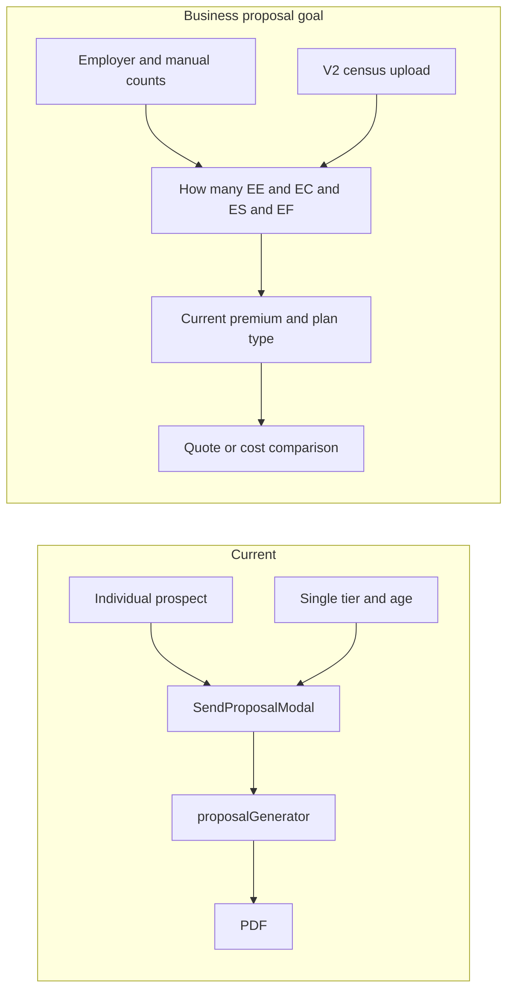

# Business Proposals Plan

This document summarizes the **current state** of the proposal system (individual vs. business/employer proposals), **goals** from the AiOS-style reference PDF and product notes, and a **phased implementation plan**. It is the single source of truth for building employer-facing (business) proposals.

**Reference**: AiOS Apples to Apples–style employer proposal PDF (14 pages): prepared for employer, estimated results, current benefits snapshot, model assumptions, projected cost, net impact, quote vs. cost comparison. First version uses manual EE/EC/ES/EF counts; census upload is Version 2.

---

## 1. Overview

- **Individual proposals** (current): One prospect (name, email, phone, DOB, household), single tier/age, dynamic pricing and agent/client fields; generate PDF and send via email, text, or download. End-to-end implemented.
- **Business (employer) proposals** (goal): Employer-facing PDFs. **First version**: manual entry only—user enters how many EE, EC, ES, EF (and optionally by age band); current cost, participation assumptions, and two output concepts—**quote** (proposed plan only) and **cost comparison** (current vs. proposed). **Version 2**: census file upload to pre-fill tier counts.

---

## 2. Current State

| Area | Individual proposals | Business / group proposals |
|------|----------------------|----------------------------|
| **Templates** | [ProposalsPage](../../frontend/src/pages/message-center/ProposalsPage.tsx), [ProposalEditor](../../frontend/src/components/proposal-editor/ProposalEditor.tsx). Tenant-scoped, category. PDF upload, field types: text, image, price, whitespace, link, custom, calculation. | Same template system. No separate "biz" template type or "quote vs cost comparison" document type. |
| **Fields** | Price (productId + configValue for unshared amount), calculation (total_monthly, total_yearly, tier_monthly, tier_yearly, total_employee_count, percentage). [proposal.service.ts](../../frontend/src/services/proposal.service.ts) (lines 50–54). | **Partially built**: Calculation field types and `isBusinessPriceEstimate` exist. No proposal-level "default unshared amount" or "plan type" in schema. |
| **Send flow** | [SendProposalModal](../../frontend/src/components/proposals/SendProposalModal.tsx): single prospect (name, email, phone, address, DOB), household (spouse, children → tier), tobacco, age. Send email/text/download. | **Gap**: Modal has `estimateInputs` (keyed by `tier_ageBand`, e.g. EE_19-39) and **Calculation Preview** (totalMonthly, totalYearly, tierMonthlyEE/EC/ES/EF, etc.) but **no UI to enter** those counts. Calculation engine runs only when estimateInputs are non-empty—and they are never set by the user. |
| **Calculation engine** | N/A (single-member pricing from backend). | **Partially built**: [proposalCalculation.service.ts](../../frontend/src/services/proposalCalculation.service.ts) — `calculateEstimateTotals`, `mapResultsToFields`, tier × ageBand pricing via `/api/pricing/calculate` with `calculationType: 'enrollment'`. |
| **Backend PDF** | [proposalGenerator.service.js](../../backend/services/proposalGenerator.service.js): single prospect, single tier/age, fills text/image/price/link/custom/calculation from document fields. | **Gap**: [proposal-sends](../../backend/routes/proposal-sends.js) accepts only `prospectInfo`, `tier`, `tobaccoUse`, `age`. No `estimateInputs` or precomputed biz totals. Generator does not accept or render business totals (e.g. tier counts, current cost, net change). |
| **Census** | N/A | Census exists for **group member import** ([GroupMembersTab](../../frontend/src/pages/groups/GroupMembersTab.tsx), [parse-census](../../backend/routes/groups.js) with aiCensusParser). **Not** used for proposals today. |

**Summary**: Individual proposals are end-to-end. Business proposals have the **calculation logic and field types** in the frontend and the **preview UI** for totals, but **no form to enter EE/EC/ES/EF (and optionally age band) counts**, no backend support for biz inputs or "current premium / existing coverage / plan type," and no **quote vs cost comparison**. Census upload is planned for Version 2.

---

## 3. Goals

**Biz proposal fields / settings**

- Product bundle and products (possibly as proposal-level setting).
- Default Unshared Amount (configuration value on products that have it, e.g. Sharewell).
- Current premium (employer's current cost).
- **Counts for EE, EC, ES, EF** (first version: manual entry only—user is asked how many in each tier; optionally by age band if product needs it, e.g. under 40 / over 40).
- Has existing coverage / does not have existing coverage.
- Select plan type (e.g. $1,500 vs $3,000 OOP).
- **Two document outputs**: **quote** (proposed plan only) vs **cost comparison** (current vs. proposed).

**Version 2 (later)**

- Ability to **upload a census file** for the proposal (pre-fill or derive EE/EC/ES/EF counts and tier mix).

**Updates to existing (individual) flow**

- Email change, phone number format, email fitting into available space on proposal, add copay document, update logos.

---

## 4. Phased Implementation Plan

### Phase 1 – Biz proposal inputs and PDF (manual counts only; no census)

- Add UI in SendProposalModal (or a dedicated biz flow) to **ask how many EE, EC, ES, EF** (and optionally by age band, e.g. EE_19-39, EE_40-64). Manual entry only—no census file in this phase. Populate `estimateInputs` from these inputs.
- Add proposal-level or send-level **default unshared amount** and **plan type** (e.g. config value) where needed.
- Backend: extend proposal-sends and proposalGenerator to accept **business context** (e.g. `estimateInputs` or precomputed `calculationResults`) and render calculation fields and business price fields in the PDF.
- Optional: "Prepared For" (employer name/address) and "Prepared By" (advisor) as distinct from single prospect (can reuse or extend existing agent/client fields).

### Phase 2 – Quote vs cost comparison

- Define **proposal type** or **document type**: "quote" vs "cost comparison."
- Cost comparison: capture **current premium** (and optionally "has existing coverage") and include current vs. projected in template/generation.
- Templates or sections for "current benefits snapshot" and "net impact" style content.

### Phase 3 – Census upload for proposals (Version 2)

- **Version 2 only.** Allow uploading a census file in the proposal flow (reuse or adapt group census parsing).
- Map census to **tier/age counts** and pre-fill the EE/EC/ES/EF (and optionally age band) inputs that Phase 1 added.

### Phase 4 – Polish and existing flow updates

- Email/phone format, email fitting in space, copay document attachment/link, logo updates (per product notes).

---

## 5. What Is Partially Built

**Already in place**

- Calculation field types: `total_monthly`, `total_yearly`, `tier_monthly`, `tier_yearly`, `total_employee_count`, `percentage` ([proposal.service.ts](../../frontend/src/services/proposal.service.ts)).
- `isBusinessPriceEstimate` on price fields for business estimates.
- [proposalCalculation.service.ts](../../frontend/src/services/proposalCalculation.service.ts): `calculateEstimateTotals`, `mapResultsToFields`, tier × ageBand pricing via pricing API.
- Calculation Preview in SendProposalModal (totalMonthly, totalYearly, tierMonthlyEE/EC/ES/EF, etc.) when `estimateInputs` and `priceFieldEstimates` are non-empty.

**Gaps**

- No UI for users to enter estimate inputs (tier/ageBand counts).
- No backend acceptance of biz payload (`estimateInputs` or precomputed `calculationResults`) in proposal-sends or proposalGenerator.
- No quote vs cost comparison document type or current-premium/existing-coverage in schema or send payload.
- No census integration in the proposal flow (deferred to Version 2).
- No proposal-level default unshared amount or plan type in schema.

---

## 6. Appendix: AiOS-Style PDF Structure (Reference)

One-page outline of the reference employer proposal for implementers:

| Section | Content / data |
|--------|------------------|
| Prepared For | Employer name, address. |
| Prepared By | Advisor name, title, phone, email, address. |
| Estimated results | Net cost change ($/year), net opt-in change (employees), participation %. |
| Current benefits snapshot | Employees not enrolled, total employees, enrolled; current healthplan cost (per month, per year). |
| Model assumptions | Total employees, estimated enrollment %, tier mix % (Individual Only, Family, etc.), monthly pricing by tier and by Unshared Amount (e.g. $3,000 OOP). |
| Projected enrollment and cost | Projected MW enrolled count, %, projected overall cost (month, year). |
| Net impact summary | Savings per month/year, net enrollment change, net participation change. |
| Calculation steps | Participation % × total = projected enrolled; tier allocation (EE, I+1, Fam counts); cost = count × rate per tier. |
| Plan comparison | Table: Existing plan vs. MightyWELL Copay (day-to-day differences). |
| Benefits and pricing | Under 40 / Over 40 tiers, $1,500 vs $3,000 OOP, add-ons (Vision, Dental, Quest). |
| Disclaimers | Census-based estimates; final cost based on employee elections. |
