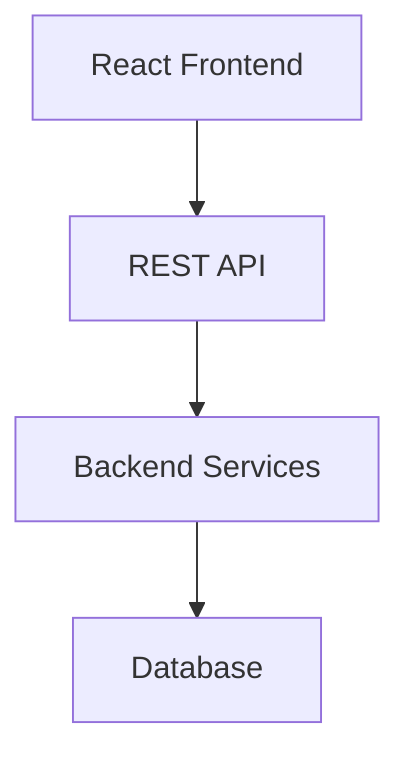
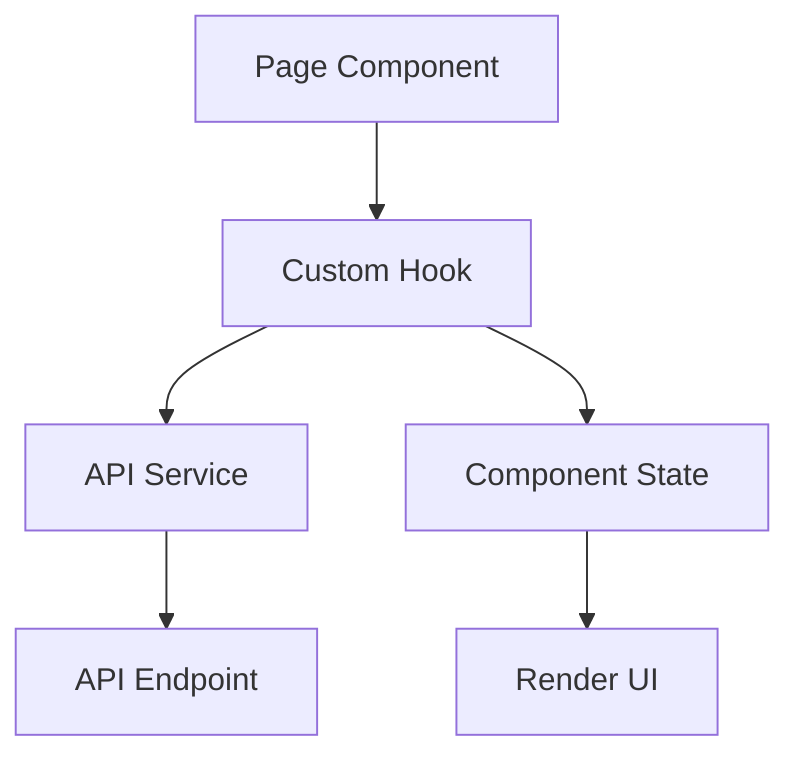
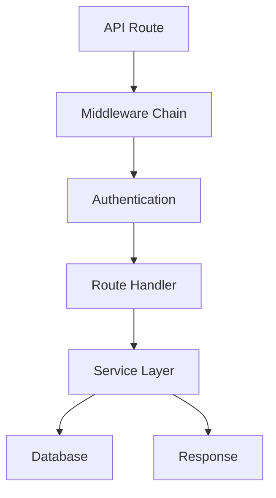
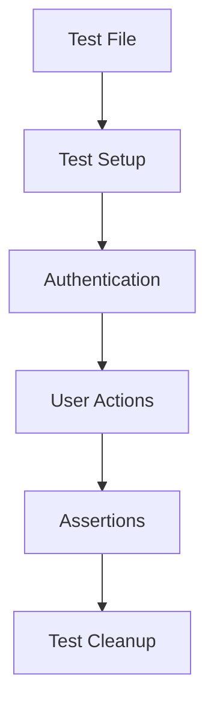

# System Patterns

## Architecture Overview

OpenEnroll follows a client-server architecture with a clear separation between frontend and backend:



### Frontend Architecture
- **React-based SPA**: Single-page application built with React
- **Context-based State Management**: Auth and tenant contexts for global state
- **React Query**: Data fetching, caching, and state management
- **Role-based Routing**: Different navigation patterns per user role
- **Component Hierarchy**:
  - Layout components (AgentLayout, TenantAdminLayout)
  - Page components
  - Reusable UI components
  - Form components

### Backend Architecture
- **Express.js API**: RESTful endpoints organized by domain
- **Middleware Pipeline**: Authentication, audit logging, error handling
- **Service Layer**: Business logic separated from route definitions
- **Database Abstraction**: Centralized database interaction

## Key Design Patterns

### Frontend Patterns
1. **Container/Presentation Pattern**: Separation of data fetching/logic from presentation
2. **Context Providers**: Auth and tenant context providers for global state
3. **Custom Hooks**: Encapsulated data fetching and business logic
4. **Protected Routes**: Role-based access control for navigation
5. **Render Props/HOCs**: For cross-cutting concerns like error boundaries

### Backend Patterns
1. **Middleware Chain**: Request processing pipeline
2. **Service Layer**: Business logic encapsulation
3. **Repository Pattern**: Database access abstraction
4. **Dependency Injection**: Service composition
5. **Event-driven Architecture**: For audit logging and notifications

### Testing Patterns
1. **Component Testing**: Unit tests for isolated component behavior
2. **End-to-End Testing**: Cypress tests for full user workflows
3. **Authentication Mocking**: Session-based auth simulation for tests
4. **Visual Regression**: Screenshot-based comparison for UI changes
5. **Test Data Isolation**: Separate test data from production

## Component Relationships

### Frontend Module Structure
```
src/
  ├── components/        # Reusable UI components
  │   ├── agent/         # Agent-specific components
  │   ├── tenant-admin/  # Tenant admin components
  │   ├── common/        # Shared components
  │   └── forms/         # Form components
  ├── contexts/          # Context providers
  ├── hooks/             # Custom hooks
  ├── pages/             # Page components
  │   ├── agent/         # Agent pages
  │   ├── tenant-admin/  # Tenant admin pages
  │   └── admin/         # System admin pages
  ├── services/          # API service clients
  └── utils/             # Utility functions
```

### Backend Module Structure
```
backend/
  ├── routes/            # API route definitions
  │   ├── admin/         # Admin routes
  │   └── ...            # Other domain routes
  ├── middleware/        # Express middleware
  ├── services/          # Business logic services
  └── config/            # Configuration
```

### Testing Structure
```
frontend/
  ├── cypress/
  │   ├── e2e/           # End-to-end tests
  │   ├── fixtures/      # Test data
  │   ├── support/       # Test helpers and commands
  │   ├── screenshots/   # Visual test results
  │   └── videos/        # Test run recordings
  └── src/
      └── __tests__/     # Unit and component tests
```

## Data Flow Patterns

### Frontend Data Flow


### Backend Data Flow


### Test Flow Patterns


## UI Component Patterns

1. **Layout Components**: Consistent page structure with navigation
2. **Card Patterns**: Content grouping with consistent styling
3. **Table Patterns**: Data display with sorting and filtering
4. **Form Patterns**: Consistent validation and submission handling
5. **Modal Patterns**: Consistent dialog behaviors

## State Management

1. **Local Component State**: For component-specific UI state
2. **React Context**: For global app state (auth, tenant context)
3. **React Query**: For server state (data fetching, mutations)
4. **URL State**: For shareable UI state (tab selection, filters)

## Error Handling

1. **Frontend Error Boundaries**: Component-level error isolation
2. **API Error Handling**: Consistent error response structure
3. **Form Validation**: Client-side and server-side validation
4. **Error Notifications**: User-friendly error messages

## Testing Strategies

1. **Unit Testing**: Individual components and functions
2. **Integration Testing**: Component interactions
3. **End-to-End Testing**: Complete user workflows
4. **Visual Regression**: UI appearance validation
5. **Accessibility Testing**: WCAG compliance checks

## Code Organization Conventions

1. **Feature-based Organization**: Components grouped by feature/domain
2. **Consistent Naming**: PascalCase for components, camelCase for functions/variables
3. **Type Definitions**: Shared types for consistent data structures
4. **Service Abstraction**: API interactions encapsulated in service modules
5. **Test Co-location**: Tests placed close to implementation files 